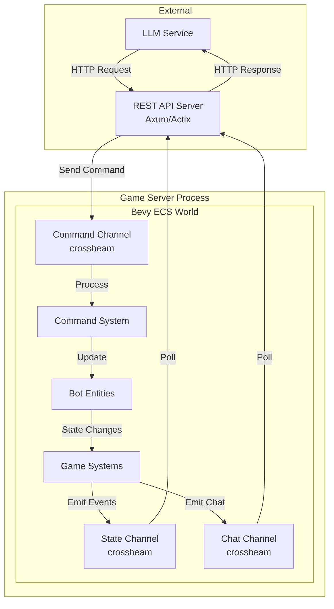
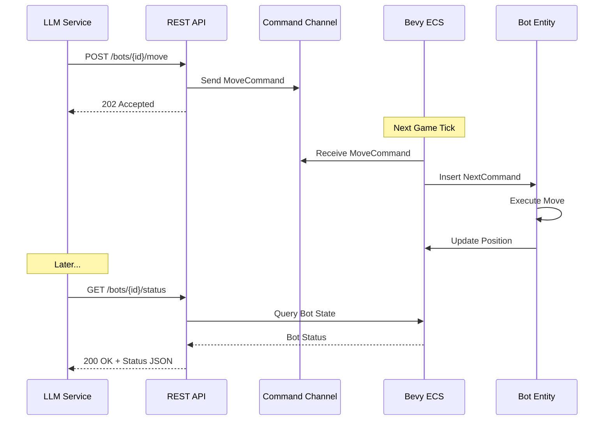
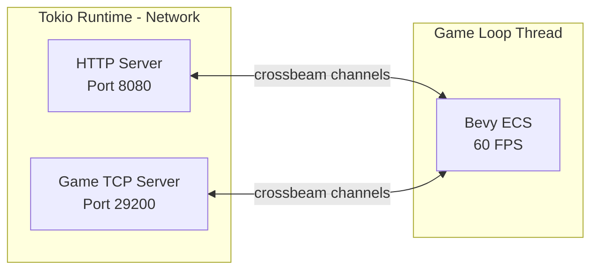

# LLM-Controlled Buddy Bot REST API Design

## Executive Summary

This document outlines the design for a REST API that enables an LLM (Large Language Model) to control a bot player in the ROSE Offline server. The bot will act as a "buddy" that can follow an assigned player, chat with them, and fully control its character through movement, skills, and actions.

## Table of Contents

1. [Existing Bot Architecture Overview](#existing-bot-architecture-overview)
2. [REST API Endpoint Specifications](#rest-api-endpoint-specifications)
3. [Data Flow Architecture](#data-flow-architecture)
4. [Implementation Recommendations](#implementation-recommendations)
5. [Required Dependencies](#required-dependencies)
6. [Security Considerations](#security-considerations)

---

## Existing Bot Architecture Overview

### Core Components

The existing bot system is built on top of the **Bevy ECS** (Entity Component System) framework and uses **big-brain** for AI behavior trees.

#### Bot Module Structure

```
rose-offline-server/src/game/bots/
├── mod.rs                    # BotPlugin, thinker configuration
├── create_bot.rs             # Bot creation and build definitions
├── bot_attack_target.rs      # Attack behavior
├── bot_attack_threat.rs      # Threat response
├── bot_use_attack_skill.rs   # Skill usage
├── bot_use_buff_skill.rs     # Buff skills
├── bot_find_nearby_target.rs # Target detection
├── bot_pickup_item.rs        # Item pickup
├── bot_join_zone.rs          # Zone transitions
├── bot_revive.rs             # Death/revive handling
├── bot_sit_recover_hp.rs     # HP recovery
├── bot_accept_party_invite.rs # Party management
├── bot_send_party_invite.rs  # Party invitations
└── bot_snowball_fight.rs     # Special event behavior
```

#### Key Components

| Component | Purpose | File |
|-----------|---------|------|
| [`BotBuild`](rose-offline-server/src/game/bots/create_bot.rs:23) | Defines bot class, stats, skills | `create_bot.rs` |
| [`BotCombatTarget`](rose-offline-server/src/game/bots/mod.rs:74) | Tracks current combat target | `mod.rs` |
| [`Command`](rose-offline-server/src/game/components/command.rs:76) | Current executing command | `command.rs` |
| [`NextCommand`](rose-offline-server/src/game/components/next_command.rs:9) | Queued next command | `next_command.rs` |
| [`Position`](rose-offline-server/src/game/components/position.rs:8) | Entity position and zone | `position.rs` |
| [`HealthPoints`](rose-game-common/src/components/health_points.rs) | Current HP | `health_points.rs` |
| [`ManaPoints`](rose-game-common/src/components/mana_points.rs) | Current MP | `mana_points.rs` |
| [`AbilityValues`](rose-game-common/src/components/ability_values.rs) | Calculated stats | `ability_values.rs` |

#### Command System

The [`CommandData`](rose-offline-server/src/game/components/command.rs:19) enum defines all available actions:

```rust
pub enum CommandData {
    Die { killer: Option<Entity>, damage: Option<Damage> },
    Stop { send_message: bool },
    Move { destination: Vec3, target: Option<Entity>, move_mode: Option<MoveMode> },
    Attack { target: Entity },
    PickupItemDrop { target: Entity },
    PersonalStore,
    CastSkill { skill_id: SkillId, skill_target: Option<CommandCastSkillTarget>, ... },
    Sitting,
    Sit,
    Standing,
    Emote { motion_id: MotionId, is_stop: bool },
}
```

#### Big-Brain Thinker Pattern

Bots use a priority-based thinker defined in [`bot_thinker()`](rose-offline-server/src/game/bots/mod.rs:120):

```
Priority Order (Highest to Lowest):
1. IsDead → ReviveCurrentZone
2. IsTeleporting → JoinZone
3. HasPartyInvite → AcceptPartyInvite
4. ThreatIsNotTarget → AttackThreat
5. ShouldUseAttackSkill → UseAttackSkill
6. ShouldAttackTarget → ActionAttackTarget
7. CanPartyInviteNearbyBot → PartyInviteNearbyBot
8. FindNearbyItemDrop → PickupNearestItemDrop
9. ShouldSitRecoverHp → SitRecoverHp
10. ShouldUseBuffSkill → UseBuffSkill
11. FindNearbyTarget → AttackRandomNearbyTarget
12. Otherwise → FindMonsterSpawns
```

### Chat System

Chat messages flow through the [`GameClient`](rose-offline-server/src/game/components/game_client.rs:8) component:

- **Incoming**: `ClientMessage::Chat { text }` received via `client_message_rx` channel
- **Outgoing**: `ServerMessage::LocalChat { entity_id, text }` sent via `server_message_tx`

Chat types in [`ServerMessage`](rose-game-common/src/messages/server.rs:401):
- `LocalChat` - Proximity-based chat
- `ShoutChat` - Zone-wide shout
- `AnnounceChat` - Server announcement

### Game Loop Architecture

The game runs at 60 FPS using Bevy's `ScheduleRunnerPlugin`:

```
Startup → PreUpdate → Update → PostUpdate → Last
```

Key systems for bot control:
- `game_server_main_system` - Processes client messages
- `command_system` - Executes commands
- `update_position_system` - Updates entity positions

---

## REST API Endpoint Specifications

### Base URL

```
http://localhost:8080/api/v1
```

### Authentication

All endpoints require an API key header:

```
Authorization: Bearer <api_key>
```

### Bot Management Endpoints

#### Create Buddy Bot

```http
POST /bots
Content-Type: application/json

{
  "name": "BuddyBot",
  "level": 50,
  "build": "knight",  // Optional: knight, champion, mage, cleric, raider, scout, bourgeois, artisan
  "assigned_player": "PlayerName"  // Player to follow
}
```

**Response:**
```json
{
  "bot_id": "uuid-here",
  "entity_id": 12345,
  "name": "BuddyBot",
  "status": "created"
}
```

#### Delete Bot

```http
DELETE /bots/{bot_id}
```

#### List All Bots

```http
GET /bots
```

**Response:**
```json
{
  "bots": [
    {
      "bot_id": "uuid-here",
      "name": "BuddyBot",
      "level": 50,
      "health": { "current": 1000, "max": 1000 },
      "position": { "x": 520000.0, "y": 520000.0, "z": 0.0, "zone_id": 1 },
      "assigned_player": "PlayerName",
      "status": "active"
    }
  ]
}
```

### Bot Control Endpoints

#### Move Bot

```http
POST /bots/{bot_id}/move
Content-Type: application/json

{
  "destination": { "x": 521000.0, "y": 521000.0, "z": 0.0 },
  "target_entity_id": null,  // Optional: entity to follow
  "move_mode": "run"  // Optional: walk, run
}
```

#### Follow Player

```http
POST /bots/{bot_id}/follow
Content-Type: application/json

{
  "player_name": "PlayerName",  // Player to follow
  "distance": 300.0  // Optional: follow distance (default: 300)
}
```

#### Stop Movement

```http
POST /bots/{bot_id}/stop
```

#### Attack Target

```http
POST /bots/{bot_id}/attack
Content-Type: application/json

{
  "target_entity_id": 54321  // Entity ID to attack
}
```

#### Use Skill

```http
POST /bots/{bot_id}/skill
Content-Type: application/json

{
  "skill_id": 201,
  "target_type": "entity",  // entity, position, self
  "target_entity_id": 54321,  // Required if target_type is entity
  "target_position": { "x": 100.0, "y": 100.0 }  // Required if target_type is position
}
```

#### Sit/Stand

```http
POST /bots/{bot_id}/sit
POST /bots/{bot_id}/stand
```

#### Pickup Item

```http
POST /bots/{bot_id}/pickup
Content-Type: application/json

{
  "item_entity_id": 67890
}
```

#### Emote

```http
POST /bots/{bot_id}/emote
Content-Type: application/json

{
  "emote_id": 1,
  "is_stop": false
}
```

### Chat Endpoints

#### Send Chat Message

```http
POST /bots/{bot_id}/chat
Content-Type: application/json

{
  "message": "Hello, I am your buddy!",
  "chat_type": "local"  // local, shout
}
```

#### Get Chat History

```http
GET /bots/{bot_id}/chat/history
```

**Response:**
```json
{
  "messages": [
    {
      "timestamp": "2024-01-15T10:30:00Z",
      "sender_name": "PlayerName",
      "sender_entity_id": 12345,
      "message": "Hello bot!",
      "chat_type": "local"
    }
  ]
}
```

#### Get Nearby Chat (Stream)

```http
GET /bots/{bot_id}/chat/stream
Accept: text/event-stream
```

Server-Sent Events stream of chat messages near the bot.

### Status Endpoints

#### Get Bot Status

```http
GET /bots/{bot_id}/status
```

**Response:**
```json
{
  "bot_id": "uuid-here",
  "name": "BuddyBot",
  "level": 50,
  "job": "Knight",
  "health": { "current": 850, "max": 1000 },
  "mana": { "current": 200, "max": 300 },
  "stamina": { "current": 1000, "max": 1000 },
  "position": { "x": 520000.0, "y": 520000.0, "z": 0.0, "zone_id": 1 },
  "current_command": "Move",
  "assigned_player": "PlayerName",
  "is_dead": false,
  "is_sitting": false
}
```

#### Get Nearby Entities

```http
GET /bots/{bot_id}/nearby
Query Parameters:
  - radius: float (default: 1000.0)
  - entity_types: string (comma-separated: players, monsters, npcs, items)
```

**Response:**
```json
{
  "entities": [
    {
      "entity_id": 54321,
      "entity_type": "monster",
      "name": "Jelly Bean",
      "level": 45,
      "position": { "x": 521500.0, "y": 521500.0, "z": 0.0 },
      "distance": 707.1,
      "health_percent": 100
    },
    {
      "entity_id": 12345,
      "entity_type": "player",
      "name": "PlayerName",
      "position": { "x": 520300.0, "y": 520300.0, "z": 0.0 },
      "distance": 424.3
    }
  ]
}
```

#### Get Bot Skills

```http
GET /bots/{bot_id}/skills
```

**Response:**
```json
{
  "skills": [
    {
      "slot": 0,
      "skill_id": 201,
      "name": "Melee Weapon Mastery",
      "level": 10,
      "mp_cost": 0,
      "cooldown": 0.0
    }
  ]
}
```

### LLM Integration Endpoints

#### Get Bot Context (for LLM)

Returns a comprehensive status snapshot optimized for LLM context injection.

```http
GET /bots/{bot_id}/context
```

**Response:**
```json
{
  "bot": {
    "name": "BuddyBot",
    "level": 50,
    "job": "Knight",
    "health_percent": 85,
    "mana_percent": 66,
    "position": { "x": 520000.0, "y": 520000.0 },
    "zone": "Adventure Plains"
  },
  "assigned_player": {
    "name": "PlayerName",
    "distance": 300.0,
    "health_percent": 100,
    "is_in_combat": false
  },
  "nearby_threats": [
    { "name": "Jelly Bean", "level": 45, "distance": 500.0 }
  ],
  "nearby_items": [
    { "name": "Gold", "distance": 100.0 }
  ],
  "recent_chat": [
    { "sender": "PlayerName", "message": "Follow me!" }
  ],
  "available_actions": ["move", "attack", "follow", "chat", "use_skill"]
}
```

#### Execute LLM Command

Single endpoint for LLM to execute any command with natural language action type.

```http
POST /bots/{bot_id}/execute
Content-Type: application/json

{
  "action": "follow_player",
  "parameters": {
    "player_name": "PlayerName"
  }
}
```

**Action Types:**
- `follow_player` - Follow assigned player
- `move_to` - Move to position
- `attack_nearest` - Attack nearest monster
- `attack_target` - Attack specific entity
- `use_skill` - Use a skill
- `say` - Send chat message
- `pickup_items` - Pickup nearby items
- `sit` - Sit down
- `stand` - Stand up
- `wait` - Do nothing for specified duration

---

## Data Flow Architecture

### Architecture Diagram



### Communication Pattern



### Thread Architecture



### Command Queue System

The API uses an asynchronous command queue pattern:

1. **API receives request** → Validates and creates command
2. **Command sent to channel** → Non-blocking send to game thread
3. **Immediate response** → Return 202 Accepted with command ID
4. **Game thread processes** → Next tick applies command
5. **State queryable** → Subsequent GET requests show result

---

## Implementation Recommendations

### 1. Create New Module Structure

```
rose-offline-server/src/
├── game/
│   ├── bots/
│   │   ├── llm_buddy.rs      # New: LLM-controlled buddy bot component
│   │   └── ...
│   ├── components/
│   │   ├── llm_bot_state.rs  # New: LLM bot state tracking
│   │   └── ...
│   └── systems/
│       ├── llm_bot_system.rs # New: LLM bot control system
│       └── ...
├── api/                       # New module
│   ├── mod.rs
│   ├── server.rs             # Axum server setup
│   ├── routes/
│   │   ├── mod.rs
│   │   ├── bots.rs           # Bot CRUD endpoints
│   │   ├── control.rs        # Movement, attack, skills
│   │   ├── chat.rs           # Chat endpoints
│   │   └── status.rs         # Status endpoints
│   ├── handlers/
│   │   └── ...
│   ├── models/
│   │   ├── requests.rs       # Request DTOs
│   │   └── responses.rs      # Response DTOs
│   └── channels.rs           # Crossbeam channel management
└── main.rs                   # Updated to start API server
```

### 2. New Components

```rust
// src/game/components/llm_bot_state.rs

#[derive(Component)]
pub struct LlmBuddyBot {
    pub bot_id: Uuid,
    pub api_key: String,
    pub assigned_player_name: String,
    pub follow_distance: f32,
    pub chat_history: VecDeque<ChatMessage>,
    pub mode: LlmBotMode,
}

#[derive(Clone, Debug)]
pub enum LlmBotMode {
    Idle,
    Following,
    Combat,
    Chatting,
}

#[derive(Component)]
pub struct LlmBotCommand {
    pub command_id: Uuid,
    pub action: LlmAction,
}

#[derive(Clone, Debug, Serialize, Deserialize)]
pub enum LlmAction {
    MoveTo { x: f32, y: f32, z: f32 },
    FollowPlayer { player_name: String, distance: f32 },
    Attack { target_entity_id: u32 },
    UseSkill { skill_id: u32, target: Option<SkillTarget> },
    Say { message: String },
    Sit,
    Stand,
    Pickup { item_entity_id: u32 },
}
```

### 3. Channel-Based Communication

```rust
// src/api/channels.rs

use crossbeam_channel::{Sender, Receiver, unbounded};

pub struct ApiChannels {
    // API -> Game: Commands to execute
    pub command_tx: Sender<LlmBotCommand>,
    pub command_rx: Receiver<LlmBotCommand>,
    
    // Game -> API: State updates
    pub state_tx: Sender<BotStateUpdate>,
    pub state_rx: Receiver<BotStateUpdate>,
    
    // Game -> API: Chat messages
    pub chat_tx: Sender<ChatMessageEvent>,
    pub chat_rx: Receiver<ChatMessageEvent>,
}

impl ApiChannels {
    pub fn new() -> Self {
        let (command_tx, command_rx) = unbounded();
        let (state_tx, state_rx) = unbounded();
        let (chat_tx, chat_rx) = unbounded();
        Self { command_tx, command_rx, state_tx, state_rx, chat_tx, chat_rx }
    }
}
```

### 4. LLM Bot System

```rust
// src/game/systems/llm_bot_system.rs

pub fn llm_bot_command_system(
    mut commands: Commands,
    api_channels: Res<ApiChannels>,
    mut query: Query<(Entity, &LlmBuddyBot, &mut NextCommand, &Position)>,
) {
    // Process incoming commands from API
    while let Ok(llm_command) = api_channels.command_rx.try_recv() {
        if let Some((entity, _, mut next_command, position)) = query.iter_mut()
            .find(|(_, bot, _, _)| bot.bot_id == llm_command.bot_id) 
        {
            // Convert LLM action to game command
            match llm_command.action {
                LlmAction::MoveTo { x, y, z } => {
                    *next_command = NextCommand::with_move(
                        Vec3::new(x, y, z), None, None
                    );
                }
                LlmAction::Attack { target_entity_id } => {
                    // Find entity by ID and attack
                }
                // ... other actions
            }
        }
    }
}
```

### 5. API Server Setup (Axum)

```rust
// src/api/server.rs

use axum::{
    routing::{get, post, delete},
    Router,
    Extension,
};
use std::net::SocketAddr;

pub async fn start_api_server(channels: ApiChannels) {
    let app = Router::new()
        .route("/api/v1/bots", get(list_bots).post(create_bot))
        .route("/api/v1/bots/:id", get(get_bot).delete(delete_bot))
        .route("/api/v1/bots/:id/move", post(move_bot))
        .route("/api/v1/bots/:id/attack", post(attack_target))
        .route("/api/v1/bots/:id/skill", post(use_skill))
        .route("/api/v1/bots/:id/chat", post(send_chat))
        .route("/api/v1/bots/:id/chat/history", get(chat_history))
        .route("/api/v1/bots/:id/status", get(bot_status))
        .route("/api/v1/bots/:id/nearby", get(nearby_entities))
        .route("/api/v1/bots/:id/context", get(bot_context))
        .route("/api/v1/bots/:id/execute", post(execute_command))
        .layer(Extension(channels));

    let addr = SocketAddr::from(([127, 0, 0, 1], 8080));
    axum::Server::bind(&addr)
        .serve(app.into_make_service())
        .await
        .unwrap();
}
```

### 6. Integration with Main

```rust
// Updated main.rs

#[tokio::main]
async fn async_main() {
    // ... existing setup ...
    
    // Create API channels
    let api_channels = ApiChannels::new();
    
    // Clone channels for game thread
    let game_channels = api_channels.clone();
    
    // Start game thread
    std::thread::spawn(move || {
        game::GameWorld::new(game_control_rx, game_channels)
            .run(game_config, game_data);
    });
    
    // Start API server on tokio runtime
    start_api_server(api_channels).await;
}
```

---

## Required Dependencies

### Add to `Cargo.toml`

```toml
[dependencies]
# HTTP Server - Choose one:

# Option 1: Axum (Recommended - modern, type-safe)
axum = "0.7"
tower = "0.4"
tower-http = { version = "0.5", features = ["cors", "trace"] }

# Option 2: Actix Web (Alternative - mature, feature-rich)
# actix-web = "4"

# Serialization (already included)
serde = { version = "1.0", features = ["derive"] }
serde_json = "1.0"

# Async runtime (already included)
tokio = { version = "1", features = ["full"] }

# UUID for bot IDs
uuid = { version = "1.0", features = ["v4", "serde"] }

# Already included but relevant:
# crossbeam-channel = "0.5"  # Thread communication
# bevy = { workspace = true }  # ECS framework
# big-brain = { workspace = true }  # AI behavior trees
```

### Dependency Justification

| Dependency | Purpose |
|------------|---------|
| `axum` | Modern async HTTP framework with excellent type safety |
| `tower` | Middleware and service utilities for axum |
| `tower-http` | CORS, tracing, and other HTTP middleware |
| `uuid` | Unique identifiers for bots and commands |
| `crossbeam-channel` | Already used; for API↔Game communication |

---

## Security Considerations

### API Key Authentication

```rust
// Middleware for API key validation
async fn auth_middleware(
    Extension(config): Extension<ApiConfig>,
    req: Request,
    next: Next,
) -> Result<Response, StatusCode> {
    let auth_header = req.headers()
        .get("Authorization")
        .and_then(|h| h.to_str().ok());
    
    match auth_header {
        Some(header) if header.starts_with("Bearer ") => {
            let key = header.trim_start_matches("Bearer ");
            if config.valid_api_keys.contains(key) {
                Ok(next.run(req).await)
            } else {
                Err(StatusCode::UNAUTHORIZED)
            }
        }
        _ => Err(StatusCode::UNAUTHORIZED)
    }
}
```

### Rate Limiting

Implement rate limiting to prevent API abuse:

```rust
use tower::ServiceBuilder;
use tower_governor::{GovernorLayer, GovernorConfigBuilder};

let governor_conf = GovernorConfigBuilder::default()
    .per_second(10)
    .burst_size(20)
    .finish()
    .unwrap();

let app = Router::new()
    .route(...)
    .layer(ServiceBuilder::new().layer(GovernorLayer { config: &governor_conf }));
```

### Input Validation

All user input must be validated:

```rust
use serde::Deserialize;
use validator::Validate;

#[derive(Deserialize, Validate)]
pub struct MoveRequest {
    #[validate(range(min = -1000000.0, max = 1000000.0))]
    pub x: f32,
    #[validate(range(min = -1000000.0, max = 1000000.0))]
    pub y: f32,
    #[validate(range(min = -10000.0, max = 10000.0))]
    pub z: f32,
}
```

### Bot Creation Limits

- Maximum bots per API key
- Bot name validation (no impersonation)
- Level caps for created bots

---

## Future Enhancements

1. **WebSocket Support**: Real-time bidirectional communication for instant state updates
2. **OpenAPI Specification**: Auto-generated API documentation
3. **Prometheus Metrics**: Bot performance and API metrics
4. **Bot Personality System**: Configurable behavior patterns for different bot "personalities"
5. **Multi-bot Coordination**: APIs for controlling multiple bots as a group
6. **Combat AI Override**: Allow LLM to take full control of combat decisions

---

## Appendix: Error Codes

| HTTP Code | Error Code | Description |
|-----------|------------|-------------|
| 400 | INVALID_REQUEST | Malformed request body |
| 400 | INVALID_POSITION | Position out of bounds |
| 401 | UNAUTHORIZED | Invalid or missing API key |
| 404 | BOT_NOT_FOUND | Bot ID does not exist |
| 404 | PLAYER_NOT_FOUND | Assigned player not online |
| 409 | BOT_NAME_EXISTS | Bot name already taken |
| 429 | RATE_LIMITED | Too many requests |
| 500 | INTERNAL_ERROR | Server-side error |
| 503 | GAME_UNAVAILABLE | Game loop not responding |
