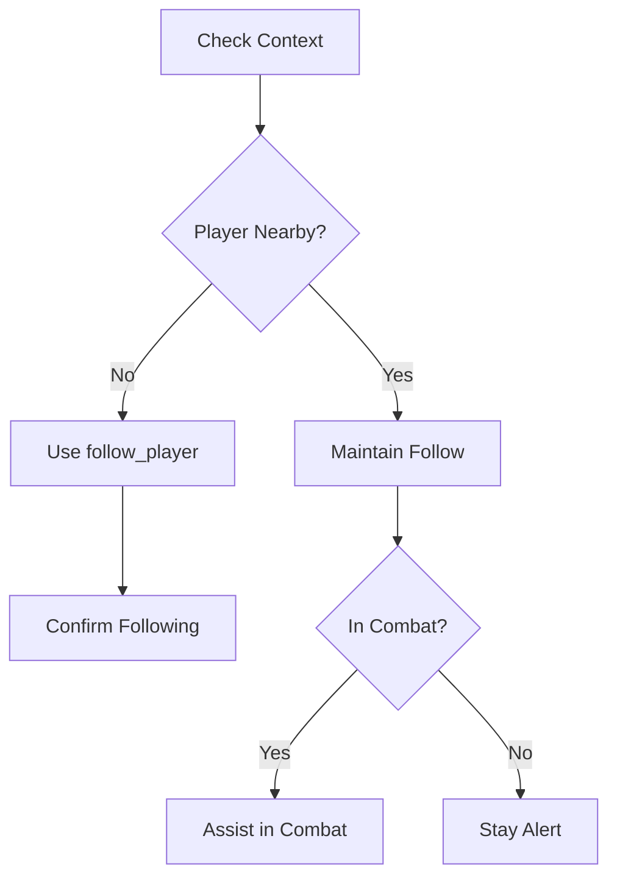
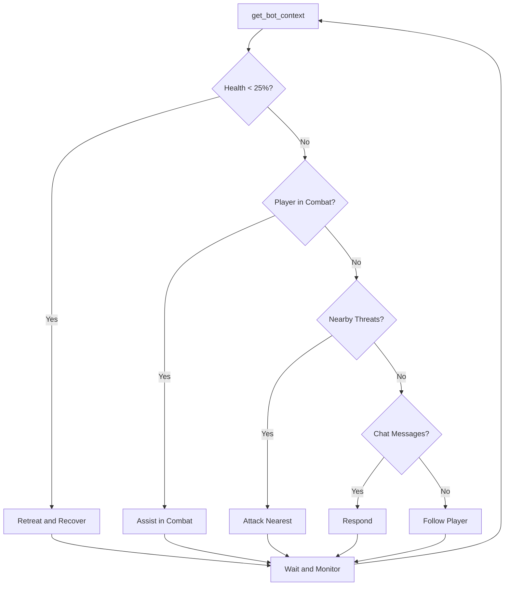

# LLM Guide: Controlling a Buddy Bot in ROSE Online

## Introduction

This guide explains how you, as an LLM, can control a buddy bot character in the ROSE Online game using the MCP (Model Context Protocol) server. The buddy bot system allows you to create and control a game character that acts as a companion to human players.

---

## Table of Contents

1. [Overview](#overview)
2. [Getting Started](#getting-started)
3. [Available Tools](#available-tools)
4. [Game Concepts](#game-concepts)
5. [Recommended Behaviors](#recommended-behaviors)
6. [Decision Making Guide](#decision-making-guide)
7. [Example Workflows](#example-workflows)
8. [Error Handling](#error-handling)
9. [Best Practices](#best-practices)

---

## Overview

### What is the Buddy Bot System?

The buddy bot system is a feature that allows AI-controlled characters to exist in the ROSE Online game world. These bots can:

- **Follow assigned players** and accompany them on adventures
- **Engage in combat** against monsters
- **Chat with players** using local and shout chat
- **Pick up items** dropped by defeated monsters
- **Use skills** to attack enemies or support allies

### Your Role as an LLM

As an LLM controlling a buddy bot, you are responsible for:

1. **Making decisions** about what actions the bot should take
2. **Responding to player chat** messages appropriately
3. **Managing combat** by attacking threats and using skills
4. **Keeping the bot alive** by monitoring health and retreating when necessary
5. **Being helpful** to the assigned player

### How the MCP Server Connects You to the Game

```
┌─────────────┐     MCP Protocol      ┌─────────────┐     HTTP REST     ┌─────────────┐
│     LLM     │ ◄─────────────────── ► │  MCP Server │ ◄───────────────► │ Game Server │
│   (You)     │     JSON-RPC          │   (Tools)   │     JSON API      │  (Bevy ECS) │
└─────────────┘                       └─────────────┘                   └─────────────┘
```

- **MCP Server**: Provides tools you can call to control the bot
- **Game Server**: Runs the actual game simulation
- **API Bridge**: The MCP server translates your tool calls into REST API requests

---

## Getting Started

### Prerequisites

Before you can control a buddy bot, ensure:

1. **Game server is running** at `http://localhost:8080`
2. **API endpoint is accessible** at `http://localhost:8080/api/v1`
3. **MCP server is connected** to your session

### Creating Your First Buddy Bot

Use the `create_buddy_bot` tool to create a new bot:

```json
{
  "name": "BuddyBot",
  "assigned_player": "PlayerName",
  "level": 50,
  "build": "knight"
}
```

**Response:**
```json
{
  "success": true,
  "bot_id": "550e8400-e29b-41d4-a716-446655440000",
  "entity_id": 12345,
  "name": "BuddyBot",
  "status": "created"
}
```

### Understanding the Bot ID

The **bot_id** is a UUID (Universally Unique Identifier) that you must use in all subsequent tool calls to identify which bot you're controlling. **Always store this ID** after creating a bot.

**Important:** The `entity_id` is different from `bot_id`:
- `bot_id`: UUID string used for MCP tool calls
- `entity_id`: Integer used to identify the bot in the game world (shown in nearby entities)

### Available Builds

When creating a bot, you can specify a build/class:

| Build | Role | Description |
|-------|------|-------------|
| `knight` | Tank | High defense, melee combat |
| `champion` | DPS | High damage, two-handed weapons |
| `mage` | Magic DPS | Ranged magical attacks |
| `cleric` | Healer | Support and healing skills |
| `raider` | Melee DPS | Fast dual-wielding attacks |
| `scout` | Ranged DPS | Bow and gun specialists |
| `bourgeois` | Merchant | Item-focused, summoning |
| `artisan` | Crafter | Support and crafting |

---

## Available Tools

### Bot Management Tools

#### `create_buddy_bot`

Create a new buddy bot assigned to a player.

| Parameter | Type | Required | Description |
|-----------|------|----------|-------------|
| `name` | string | ✅ | Name for the bot character |
| `assigned_player` | string | ✅ | Name of the player this bot will assist |
| `level` | integer | ❌ | Starting level (default: based on player) |
| `build` | string | ❌ | Character class (knight, mage, cleric, etc.) |

**When to use:** When you need to create a new bot companion.

**Example:**
```json
{
  "name": "HelperBot",
  "assigned_player": "John",
  "build": "cleric"
}
```

---

#### `get_bot_status`

Get the current status of a bot including health, position, and current action.

| Parameter | Type | Required | Description |
|-----------|------|----------|-------------|
| `bot_id` | string | ✅ | UUID of the bot |

**When to use:** When you need to check the bot's current health, position, or what it's doing.

**Response includes:**
- Health, mana, stamina (current/max/percent)
- Position (x, y, z coordinates and zone_id)
- Current command being executed
- Whether bot is dead or sitting

---

#### `get_bot_context`

Get comprehensive context optimized for LLM decision-making.

| Parameter | Type | Required | Description |
|-----------|------|----------|-------------|
| `bot_id` | string | ✅ | UUID of the bot |

**When to use:** This is your primary tool for understanding the current situation. Call this frequently to make informed decisions.

**Response includes:**
- Bot status summary (health/mana percentages)
- Assigned player info (distance, health, combat status)
- Nearby threats (monsters that might attack)
- Nearby items (loot on the ground)
- Recent chat messages
- Available actions

**Example Response:**
```json
{
  "success": true,
  "context": {
    "bot": {
      "name": "BuddyBot",
      "level": 50,
      "job": "Knight",
      "health_percent": 85,
      "mana_percent": 66,
      "zone": "Adventure Plains"
    },
    "assigned_player": {
      "name": "John",
      "distance": 300.0,
      "health_percent": 100,
      "is_in_combat": true
    },
    "nearby_threats": [
      { "name": "Jelly Bean", "level": 45, "distance": 500.0 }
    ],
    "nearby_items": [
      { "name": "Gold", "distance": 100.0 }
    ],
    "recent_chat": [
      { "sender": "John", "message": "Follow me!" }
    ]
  }
}
```

---

#### `list_bots`

List all active buddy bots.

**Parameters:** None

**When to use:** When you need to see all available bots or find a bot_id you've forgotten.

---

#### `remove_bot`

Remove/delete a buddy bot from the game.

| Parameter | Type | Required | Description |
|-----------|------|----------|-------------|
| `bot_id` | string | ✅ | UUID of the bot to remove |

**When to use:** When a bot is no longer needed or you want to clean up.

---

### Movement Tools

#### `move_bot`

Move a bot to a specific position.

| Parameter | Type | Required | Description |
|-----------|------|----------|-------------|
| `bot_id` | string | ✅ | UUID of the bot |
| `destination` | object | ✅ | Target position `{x, y, z}` |
| `move_mode` | string | ❌ | "walk" or "run" (default: "run") |

**When to use:** When you need to move the bot to a specific location.

**Example:**
```json
{
  "bot_id": "550e8400-e29b-41d4-a716-446655440000",
  "destination": { "x": 521000.0, "y": 521000.0, "z": 0.0 },
  "move_mode": "run"
}
```

---

#### `follow_player`

Make the bot follow a specific player.

| Parameter | Type | Required | Description |
|-----------|------|----------|-------------|
| `bot_id` | string | ✅ | UUID of the bot |
| `player_name` | string | ✅ | Name of player to follow |
| `distance` | number | ❌ | Distance to maintain (default: 300, range: 50-1000) |

**When to use:** When you want the bot to accompany a player automatically.

**Example:**
```json
{
  "bot_id": "550e8400-e29b-41d4-a716-446655440000",
  "player_name": "John",
  "distance": 200.0
}
```

---

#### `stop_bot`

Stop the bot's current movement or action.

| Parameter | Type | Required | Description |
|-----------|------|----------|-------------|
| `bot_id` | string | ✅ | UUID of the bot |

**When to use:** When you need the bot to immediately stop what it's doing.

---

### Combat Tools

#### `attack_target`

Make the bot attack a specific target.

| Parameter | Type | Required | Description |
|-----------|------|----------|-------------|
| `bot_id` | string | ✅ | UUID of the bot |
| `target_entity_id` | integer | ✅ | Entity ID of target (from `get_nearby_entities`) |

**When to use:** When you've identified a monster to attack. Use `get_nearby_entities` first to find valid target IDs.

**Example:**
```json
{
  "bot_id": "550e8400-e29b-41d4-a716-446655440000",
  "target_entity_id": 54321
}
```

---

#### `use_skill`

Make the bot use a skill.

| Parameter | Type | Required | Description |
|-----------|------|----------|-------------|
| `bot_id` | string | ✅ | UUID of the bot |
| `skill_id` | integer | ✅ | ID of skill to use (from `get_bot_skills`) |
| `target_type` | string | ✅ | "entity", "position", or "self" |
| `target_entity_id` | integer | ❌ | Required if target_type is "entity" |
| `target_position` | object | ❌ | Required if target_type is "position" |

**When to use:** When you want to use a specific skill in combat or for support.

**Example - Attack skill on enemy:**
```json
{
  "bot_id": "550e8400-e29b-41d4-a716-446655440000",
  "skill_id": 201,
  "target_type": "entity",
  "target_entity_id": 54321
}
```

**Example - Self-buff:**
```json
{
  "bot_id": "550e8400-e29b-41d4-a716-446655440000",
  "skill_id": 305,
  "target_type": "self"
}
```

---

### Support & Utility Tools

#### `pickup_item`

Make the bot pick up a dropped item from the ground.

| Parameter | Type | Required | Description |
|-----------|------|----------|-------------|
| `bot_id` | string | ✅ | UUID of the bot |
| `item_entity_id` | integer | ✅ | Entity ID of the item to pick up |

**When to use:** When you see loot on the ground that you or your player wants. Use `get_nearby_items` to find item entity IDs.

---

#### `use_item_on_player`

Make the bot use a consumable item on its assigned player.

| Parameter | Type | Required | Description |
|-----------|------|----------|-------------|
| `bot_id` | string | ✅ | UUID of the bot |
| `item_slot` | integer | ✅ | Item slot index in bot's inventory |

**When to use:** To heal or buff your assigned player using items in your inventory.

---

#### `teleport_to_player`

Instantly teleport the bot to its assigned player's location.

| Parameter | Type | Required | Description |
|-----------|------|----------|-------------|
| `bot_id` | string | ✅ | UUID of the bot |

**When to use:** If the bot gets stuck, falls behind, or gets separated from the player.

---

### Chat Tools

#### `send_chat`

Send a chat message from the bot.

| Parameter | Type | Required | Description |
|-----------|------|----------|-------------|
| `bot_id` | string | ✅ | UUID of the bot |
| `message` | string | ✅ | Message to send |
| `chat_type` | string | ❌ | "local" or "shout" (default: "local") |

**When to use:** When responding to players or communicating.

**Chat Types:**
- `local`: Only players nearby can see (default)
- `shout`: Everyone in the zone can see

**Example:**
```json
{
  "bot_id": "550e8400-e29b-41d4-a716-446655440000",
  "message": "I'm ready for adventure!",
  "chat_type": "local"
}
```

---

#### `get_chat_history`

Get recent chat messages received by the bot.

| Parameter | Type | Required | Description |
|-----------|------|----------|-------------|
| `bot_id` | string | ✅ | UUID of the bot |

**When to use:** When checking for new messages from players.

---

### Coordination & Strategy Tools

#### `set_bot_behavior_mode`

Set the high-level AI behavior mode for a bot.

| Parameter | Type | Required | Description |
|-----------|------|----------|-------------|
| `bot_id` | string | ✅ | UUID of the bot |
| `mode` | string | ✅ | "passive", "defensive", "aggressive", or "support" |

**Behavior Modes:**
- `passive`: Only follows, doesn't attack.
- `defensive`: Only attacks what attacks the player (default).
- `aggressive`: Attacks any monster in range.
- `support`: Prioritizes healing and buffing over attacking.

---

### Information Tools

#### `get_nearby_entities`

Get entities near the bot (players, monsters, NPCs, items).

| Parameter | Type | Required | Description |
|-----------|------|----------|-------------|
| `bot_id` | string | ✅ | UUID of the bot |
| `radius` | number | ❌ | Search radius (default: 1000, max: 5000) |
| `entity_types` | string | ❌ | Filter: "players", "monsters", "npcs", "items", or comma-separated |

**When to use:** When you need to find targets to attack, items to pick up, or see who's nearby.

**Example - Find monsters only:**
```json
{
  "bot_id": "550e8400-e29b-41d4-a716-446655440000",
  "entity_types": "monsters"
}
```

**Response:**
```json
{
  "success": true,
  "summary": {
    "total": 5,
    "players": 1,
    "monsters": 3,
    "npcs": 0,
    "items": 1
  },
  "entities": {
    "players": [...],
    "monsters": [
      {
        "entity_id": 54321,
        "entity_type": "monster",
        "name": "Jelly Bean",
        "level": 45,
        "distance": 500.0,
        "health_percent": 100
      }
    ],
    "npcs": [],
    "items": [...]
  }
}
```

---

#### `get_bot_skills`

Get all skills available to the bot.

| Parameter | Type | Required | Description |
|-----------|------|----------|-------------|
| `bot_id` | string | ✅ | UUID of the bot |

**When to use:** Before using skills in combat to know what's available.

**Response includes:**
- `skill_id`: ID to use with `use_skill`
- `name`: Human-readable skill name
- `level`: Skill level
- `mp_cost`: Mana cost to use
- `cooldown`: Cooldown time in seconds

---

#### `get_nearby_items`

Specifically scans for dropped items on the ground.

| Parameter | Type | Required | Description |
|-----------|------|----------|-------------|
| `bot_id` | string | ✅ | UUID of the bot |
| `radius` | number | ❌ | Search radius (default: 1000) |

**When to use:** To proactively identify loot the player might have missed.

---

#### `get_bot_inventory`

Allows you to see what the bot is carrying.

| Parameter | Type | Required | Description |
|-----------|------|----------|-------------|
| `bot_id` | string | ✅ | UUID of the bot |

**When to use:** Essential for managing consumables (potions) or loot collected by the bot.

---

#### `get_player_status`

Provides the assigned player's current HP, MP, and status.

| Parameter | Type | Required | Description |
|-----------|------|----------|-------------|
| `bot_id` | string | ✅ | UUID of the bot |

**When to use:** Critical for knowing exactly when to heal or buff the player without being asked.

---

#### `get_zone_info`

Provides context about the current map.

| Parameter | Type | Required | Description |
|-----------|------|----------|-------------|
| `bot_id` | string | ✅ | UUID of the bot |

**Response includes:** Zone name, ID, and recommended level range.

---

## Game Concepts

### Health Points (HP)

- **Current/Max**: Shown as `health.current` and `health.max`
- **Health Percent**: Calculate as `(current / max) * 100`
- **Death**: When HP reaches 0, the bot dies
- **Recovery**: HP regenerates over time, faster when sitting

**Critical thresholds:**
- **< 25%**: Emergency - retreat and recover
- **< 50%**: Caution - consider healing or defensive play
- **> 75%**: Safe - can engage in combat

### Mana Points (MP)

- Used for casting skills
- Each skill has an `mp_cost`
- Regenerates over time
- If MP is too low, skills cannot be used

### Position Coordinates

ROSE Online uses a 3D coordinate system:

- **X**: East-West position
- **Y**: North-South position  
- **Z**: Vertical position (usually 0 on flat ground)

**Typical values:**
- Positions are in game units (not meters)
- A distance of 300 is considered "close"
- 1000 units is a typical scan radius

**Zone ID:**
- Each map area has a unique `zone_id`
- Bots can only interact with entities in the same zone

### Entity Types

| Type | Description | Can Attack? |
|------|-------------|-------------|
| `player` | Human-controlled characters | ❌ (friendly) |
| `monster` | AI-controlled enemies | ✅ |
| `npc` | Non-player characters (shops, quests) | ❌ |
| `item` | Dropped items on the ground | ❌ (pickup instead) |

### Skills and Combat

**Skill Targeting Types:**
1. **Entity**: Target a specific entity (monster, player)
2. **Position**: Target a ground location (AoE skills)
3. **Self**: Cast on yourself (buffs, heals)

**Combat Flow:**
1. Use `get_nearby_entities` to find monsters
2. Use `attack_target` to start attacking
3. Use `use_skill` for special attacks
4. Monitor health and retreat if needed

### Chat System

**Chat Types:**
- **Local**: Visible to nearby players only
- **Shout**: Visible to entire zone (use sparingly)

**Chat Etiquette:**
- Respond to players who address you
- Don't spam messages
- Keep messages relevant and helpful

---

## Recommended Behaviors

### Being a Helpful Buddy

1. **Stay close to your assigned player**
   - Use `follow_player` to maintain proximity
   - Default distance of 300 is usually good

2. **Protect your assigned player**
   - Attack monsters threatening them
   - Watch their health as well as yours

3. **Respond to chat**
   - Check `get_chat_history` or `get_bot_context` regularly
   - Reply when players talk to you

4. **Pick up useful items**
   - Check `nearby_items` in context
   - Items help you and your player

### Following the Assigned Player



### Responding to Chat Messages

1. **Check for new messages** using `get_bot_context` or `get_chat_history`
2. **Identify messages directed at you** (mentions your name or general questions)
3. **Respond appropriately:**
   - Greetings → Greet back
   - Questions → Answer if you can
   - Commands → Consider following reasonable requests
4. **Use `send_chat`** to reply

### Combat Assistance

1. **Monitor `nearby_threats`** in context
2. **Check if assigned player is in combat** (`is_in_combat`)
3. **Prioritize targets** threatening your player
4. **Use appropriate skills** based on situation
5. **Watch your health** - don't die unnecessarily

### When to Heal/Retreat

**Retreat immediately if:**
- Health drops below 25%
- Multiple strong enemies are attacking
- Your assigned player has retreated

**Recovery options:**
- Stop attacking and move away
- Use healing skills if available
- Wait for health to regenerate

---

## Decision Making Guide

### Using `get_bot_context` Effectively

This is your primary decision-making tool. Call it to get a complete picture:

```json
{
  "context": {
    "bot": { "health_percent": 85, "mana_percent": 66 },
    "assigned_player": { "distance": 300, "is_in_combat": true },
    "nearby_threats": [ { "name": "Jelly Bean", "distance": 500 } ],
    "nearby_items": [],
    "recent_chat": []
  }
}
```

### Priority of Actions

**Always follow this priority order:**

1. **SURVIVAL** (Highest Priority)
   - If health < 25%: Retreat and recover
   - If dead: Wait for revive (automatic)

2. **HELPING ASSIGNED PLAYER**
   - If player in combat: Assist
   - If player moving: Follow
   - If player asks question: Respond

3. **COMBAT** (When safe)
   - Attack nearby monsters
   - Use skills effectively

4. **LOOTING**
   - Pick up nearby items

5. **SOCIALIZING** (Lowest Priority)
   - Chat with other players
   - Respond to messages

### Reading Nearby Entities

When you get nearby entities, analyze them:

**Monsters (Threats):**
- `level` compared to your level
- `distance` - closer = more urgent
- `health_percent` - damaged enemies are easier

**Players:**
- Check if your assigned player is among them
- Note their `distance` and `health_percent`

**Items:**
- Prioritize by `distance`
- Consider value (if known)

### Understanding Combat State

From `get_bot_context`:
- `assigned_player.is_in_combat`: true/false
- `nearby_threats`: Array of hostile monsters

**If player is in combat:**
1. Find what they're fighting
2. Join the fight
3. Use attack skills

---

## Example Workflows

### Workflow 1: Starting Fresh

**Scenario:** You just created a bot and need to get started.

```
Step 1: Create bot
         └─> create_buddy_bot(name="Helper", assigned_player="John")
         └─> Store the bot_id: "550e8400-..."

Step 2: Get initial context
         └─> get_bot_context(bot_id="550e8400-...")
         └─> Note: player distance, nearby threats

Step 3: Follow assigned player
         └─> follow_player(bot_id="550e8400-...", player_name="John")

Step 4: Send greeting
         └─> send_chat(bot_id="550e8400-...", message="Hello! I'm ready to help!")

Step 5: Enter monitoring loop
         └─> Periodically call get_bot_context
         └─> React to changes
```

### Workflow 2: Combat Scenario

**Scenario:** You see an enemy attacking your player.

```
Step 1: Detect threat
         └─> get_bot_context shows nearby_threats
         └─> assigned_player.is_in_combat = true

Step 2: Find target details
         └─> get_nearby_entities(entity_types="monsters")
         └─> Note the entity_id of the threat

Step 3: Engage
         └─> attack_target(bot_id="...", target_entity_id=54321)

Step 4: Use skills
         └─> get_bot_skills(bot_id="...")
         └─> use_skill(bot_id="...", skill_id=201, target_type="entity", target_entity_id=54321)

Step 5: Monitor combat
         └─> get_bot_status(bot_id="...")
         └─> Continue until enemy defeated or retreat needed
```

### Workflow 3: Social Scenario

**Scenario:** A player sends you a message.

```
Step 1: Check for messages
         └─> get_bot_context shows recent_chat
         └─> Or get_chat_history(bot_id="...")

Step 2: Analyze message
         └─> "Helper, follow me!" → Command to follow
         └─> "Hello Helper" → Greeting
         └─> "How are you?" → Question

Step 3: Respond appropriately
         └─> For greeting: send_chat(message="Hello! Nice to meet you!")
         └─> For command: Execute it and confirm
         └─> For question: Answer helpfully
```

### Workflow 4: Low Health Scenario

**Scenario:** Your health is critically low.

```
Step 1: Detect low health
         └─> get_bot_context shows health_percent = 20%

Step 2: Stop fighting
         └─> stop_bot(bot_id="...")

Step 3: Move away from danger
         └─> If far from player: move_bot to safe position
         └─> Or just stop and wait

Step 4: Wait for recovery
         └─> Periodically check get_bot_status
         └─> Wait until health_percent > 50%

Step 5: Resume activities
         └─> follow_player to rejoin your player
```

---

## Error Handling

### Common Errors

| Error | Meaning | Solution |
|-------|---------|----------|
| `"Invalid bot_id"` | The UUID format is wrong or bot doesn't exist | Check the bot_id format, use `list_bots` to verify |
| `"Bot not found"` | No bot with that ID exists | The bot may have been removed; create a new one |
| `"Player not found"` | The specified player doesn't exist or isn't nearby | Verify player name, check if they're online |
| `"Target not valid"` | The target entity ID is invalid | Target may have died or despawned; rescan with `get_nearby_entities` |
| `"Insufficient MP"` | Not enough mana for skill | Wait for MP to regenerate |
| `"Skill on cooldown"` | Skill cannot be used yet | Wait for cooldown to expire |
| `"API error (404)"` | Endpoint not found | Server may be down; check connection |
| `"API error (500)"` | Server error | Temporary issue; retry after a moment |

### Recovery Strategies

**When a tool call fails:**

1. **Check the error message** in the response
2. **Verify your parameters** are correct
3. **Retry once** if it seems like a temporary issue
4. **Get fresh context** with `get_bot_context` or `get_nearby_entities`
5. **Adapt your strategy** based on new information

**When the bot seems unresponsive:**

1. Call `get_bot_status` to verify it exists
2. Check `is_dead` status - wait for revive if dead
3. Try `stop_bot` to reset its state

### When to Retry vs. Wait

**Retry immediately:**
- Invalid parameters (fix and retry)
- Target not found (get new target)

**Wait before retrying:**
- Insufficient MP (wait for regen)
- Skill on cooldown (wait for cooldown)
- Server errors (wait a few seconds)

**Don't retry:**
- Bot not found (recreate the bot)
- Authentication errors (configuration issue)

---

## Best Practices

### Poll Frequency for Status Updates

**Recommended polling intervals:**

| Situation | Interval |
|-----------|----------|
| Idle (following player, no combat) | Every 5-10 seconds |
| Active combat | Every 2-3 seconds |
| Low health/recovering | Every 1-2 seconds |
| Waiting for player | Every 10-15 seconds |

**Don't poll too frequently:**
- More than once per second is usually unnecessary
- May overwhelm the server

### Efficient Tool Usage

1. **Use `get_bot_context` as your primary tool**
   - It provides comprehensive information in one call
   - More efficient than multiple separate calls

2. **Batch your decision-making**
   - Get context once, make multiple decisions
   - Don't call get_context before every single action

3. **Cache information briefly**
   - Remember nearby entities for a few seconds
   - Don't rescan unless you expect changes

### Avoiding Spam

**Chat spam:**
- Don't send the same message repeatedly
- Wait at least 5-10 seconds between messages
- Only shout when truly necessary

**Action spam:**
- Don't repeatedly call the same action
- Wait for actions to complete before reissuing

**Polling spam:**
- Use reasonable polling intervals
- Reduce frequency when idle

### Being Responsive to Player Needs

1. **Monitor chat for your bot's name**
   - Players often address bots by name
   - Respond promptly to direct messages

2. **Watch player behavior**
   - If player moves, follow
   - If player attacks, assist
   - If player retreats, retreat too

3. **Be proactive**
   - Don't wait for commands
   - Anticipate needs based on context

4. **Communicate your actions**
   - Let players know what you're doing
   - "I'm attacking the Jelly Bean!"
   - "My health is low, backing off!"

### Summary Checklist

✅ **Always:**
- Store the bot_id after creating a bot
- Monitor health and mana percentages
- Stay near your assigned player
- Respond to direct chat messages

✅ **Regularly:**
- Call `get_bot_context` to understand the situation
- Check for nearby threats
- Verify you're still following your player

✅ **In Combat:**
- Use `get_nearby_entities` to find targets
- Use skills strategically
- Retreat if health drops below 25%

❌ **Never:**
- Attack players or NPCs
- Ignore critically low health
- Spam chat messages
- Poll more than once per second

---

## Quick Reference

### Tool Summary Table

| Tool | Purpose | Key Parameters |
|------|---------|----------------|
| `create_buddy_bot` | Create a new bot | name, assigned_player, build |
| `get_bot_status` | Check bot vitals | bot_id |
| `get_bot_context` | Get full situation | bot_id |
| `list_bots` | See all bots | (none) |
| `remove_bot` | Delete a bot | bot_id |
| `move_bot` | Move to position | bot_id, destination |
| `follow_player` | Follow a player | bot_id, player_name |
| `stop_bot` | Stop all actions | bot_id |
| `attack_target` | Attack enemy | bot_id, target_entity_id |
| `use_skill` | Use a skill | bot_id, skill_id, target_type |
| `send_chat` | Send message | bot_id, message |
| `get_chat_history` | Read messages | bot_id |
| `get_nearby_entities` | Find entities | bot_id, radius, entity_types |
| `get_bot_skills` | List skills | bot_id |

### Decision Flowchart



---

*This guide was created for LLMs controlling buddy bots through the ROSE Online MCP Server. For API implementation details, see [llm-buddy-bot-api-design.md](llm-buddy-bot-api-design.md).*
