# LLM Feedback System Architecture

## Table of Contents

1. [Overview and Introduction](#1-overview-and-introduction)
2. [System Architecture](#2-system-architecture)
3. [MCP Server](#3-mcp-server)
4. [Game Server REST API](#4-game-server-rest-api)
5. [Communication Channels](#5-communication-channels)
6. [Bot Control System](#6-bot-control-system)
7. [Chat System Integration](#7-chat-system-integration)
8. [Bot Persistence](#8-bot-persistence)
9. [Build and Configuration](#9-build-and-configuration)
10. [Data Flow Diagrams](#10-data-flow-diagrams)
11. [API Reference](#11-api-reference)

---

## 1. Overview and Introduction

### 1.1 What is the LLM Feedback System?

The LLM Feedback System is a comprehensive architecture that enables Large Language Models (LLMs) like Claude to control buddy bot characters in the ROSE Online game server. It provides a bidirectional communication channel between AI assistants and the game world, allowing LLMs to:

- Create and manage bot characters
- Control bot movement and combat
- Send and receive chat messages
- Query game world state
- Make intelligent decisions based on game context

### 1.2 High-Level Architecture Diagram

```mermaid
graph TB
    subgraph "LLM Layer"
        LLM[Claude/LLM Assistant]
    end
    
    subgraph "MCP Server - rose-mcp-server/"
        MCPServer[MCP Server]
        State[Persistent State]
        APIClient[API Client]
    end
    
    subgraph "Game Server - rose-offline-server/"
        RESTAPI[REST API Server<br/>Axum :8080]
        Handlers[API Handlers]
        Channels[Crossbeam Channels]
        GameState[Game State<br/>Arc<RwLock>]
        BotSystem[Bot Systems]
        GameWorld[Game World<br/>Bevy ECS]
    end
    
    LLM <-->|JSON-RPC/stdio| MCPServer
    MCPServer -->|HTTP REST| APIClient
    APIClient -->|HTTP| RESTAPI
    RESTAPI --> Handlers
    Handlers --> Channels
    Channels --> GameState
    Channels --> BotSystem
    BotSystem --> GameWorld
    MCPServer <-->|Read/Write| State
    GameState <-->|Shared| BotSystem
```

### 1.3 Key Components Overview

| Component | Location | Purpose |
|-----------|----------|---------|
| **MCP Server** | [`rose-mcp-server/`](rose-mcp-server/) | Implements Model Context Protocol for LLM communication |
| **REST API** | [`rose-offline-server/src/game/api/`](rose-offline-server/src/game/api/) | HTTP endpoints for bot control |
| **Channel System** | [`rose-offline-server/src/game/api/channels.rs`](rose-offline-server/src/game/api/channels.rs:1) | Thread-safe command passing |
| **Bot Systems** | [`rose-offline-server/src/game/systems/llm_buddy_bot_system.rs`](rose-offline-server/src/game/systems/llm_buddy_bot_system.rs:1) | Bevy ECS systems for bot control |
| **Bot Components** | [`rose-offline-server/src/game/components/llm_buddy_bot.rs`](rose-offline-server/src/game/components/llm_buddy_bot.rs:1) | ECS components for bot state |
| **BigBrain AI** | [`rose-offline-server/src/game/bots/`](rose-offline-server/src/game/bots/) | Autonomous bot behavior system |

### 1.4 Use Cases and Capabilities

1. **AI-Assisted Gameplay**: LLMs can create companion bots that follow and assist players
2. **Automated Testing**: Bots can be controlled programmatically for testing game systems
3. **Dynamic NPCs**: Create intelligent NPCs that respond to player chat and actions
4. **Game Master Tools**: Allow AI assistants to manage game events and interactions

---

## 2. System Architecture

### 2.1 Complete Architecture Diagram

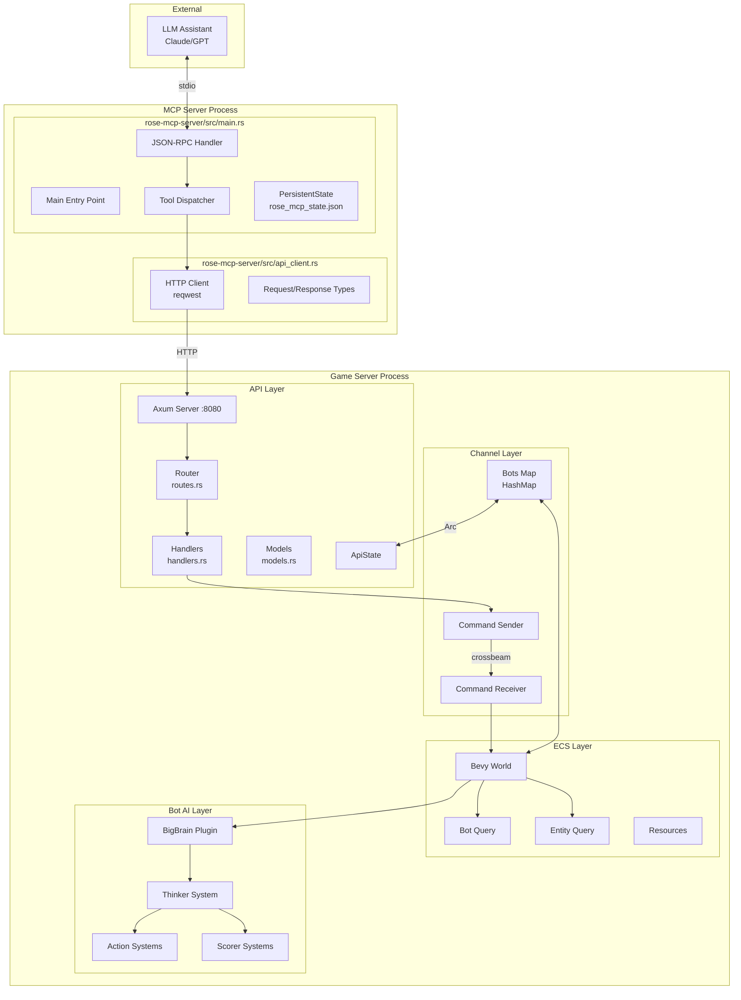

### 2.2 Component Relationships

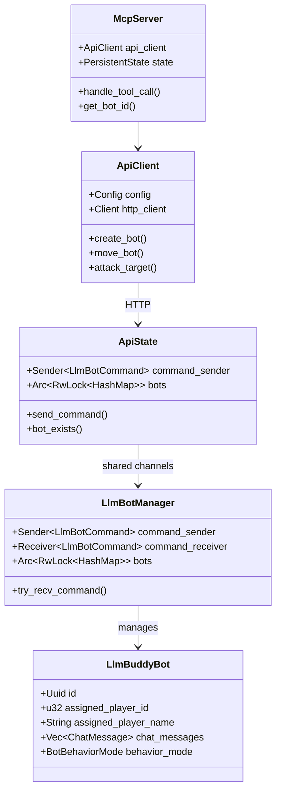

### 2.3 Thread Boundaries and Communication

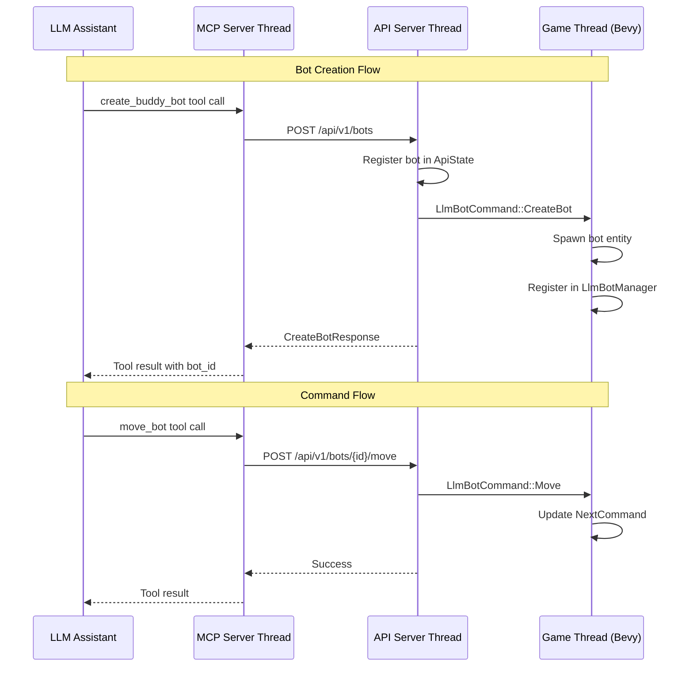

---

## 3. MCP Server

### 3.1 Server Initialization and Configuration

The MCP Server is located in [`rose-mcp-server/src/main.rs`](rose-mcp-server/src/main.rs:1) and implements the Model Context Protocol over stdio.

```rust
// CLI Arguments (main.rs:24-35)
#[derive(Parser, Debug)]
#[command(name = "rose-mcp-server")]
struct Args {
    /// Base URL for the ROSE Offline REST API
    #[arg(short, long, env = "ROSE_API_URL", default_value = "http://localhost:8080/api/v1")]
    api_url: String,

    /// Enable verbose logging
    #[arg(short, long)]
    verbose: bool,
}
```

**Configuration Options:**

| Option | CLI Flag | Environment Variable | Default |
|--------|----------|---------------------|---------|
| API URL | `-a, --api-url` | `ROSE_API_URL` | `http://localhost:8080/api/v1` |
| Verbose | `-v, --verbose` | - | `false` |

### 3.2 JSON-RPC Protocol Implementation

The server implements JSON-RPC 2.0 over stdio:

```rust
// JSON-RPC Types (main.rs:39-63)
struct JsonRpcRequest {
    jsonrpc: String,
    id: Option<Value>,
    method: String,
    params: Option<Value>,
}

struct JsonRpcResponse {
    jsonrpc: String,
    id: Option<Value>,
    result: Option<Value>,
    error: Option<JsonRpcError>,
}
```

**Supported Methods:**

| Method | Description |
|--------|-------------|
| `initialize` | Returns server capabilities and info |
| `tools/list` | Lists all available tools |
| `tools/call` | Executes a tool with arguments |
| `ping` | Health check |

### 3.3 All 22 MCP Tools

The MCP server provides 22 tools across 5 categories:

#### Bot Management Tools (5)

| Tool | Description | Required Parameters |
|------|-------------|---------------------|
| `create_buddy_bot` | Create a new buddy bot | `name`, `assigned_player` |
| `get_bot_status` | Get bot health, position, etc. | `bot_id` (optional if active) |
| `list_bots` | List all active bots | none |
| `remove_bot` | Delete a bot | `bot_id` (optional if active) |
| `get_bot_context` | Get LLM-optimized context | `bot_id` (optional if active) |

#### Movement Tools (4)

| Tool | Description | Required Parameters |
|------|-------------|---------------------|
| `move_bot` | Move to coordinates | `bot_id`, `x`, `y`, `z` |
| `follow_player` | Follow a player | `bot_id`, `player_name` |
| `stop_bot` | Stop current action | `bot_id` |
| `teleport_to_player` | Teleport to assigned player | `bot_id` |

#### Combat Tools (4)

| Tool | Description | Required Parameters |
|------|-------------|---------------------|
| `attack_target` | Attack an entity | `bot_id`, `target_entity_id` |
| `use_skill` | Use a skill | `bot_id`, `skill_id`, `target_type` |
| `pickup_item` | Pick up an item | `bot_id`, `item_entity_id` |
| `use_item_on_player` | Use item on player | `bot_id` |

#### Chat Tools (2)

| Tool | Description | Required Parameters |
|------|-------------|---------------------|
| `send_chat` | Send chat message | `bot_id`, `message` |
| `get_chat_history` | Get recent messages | `bot_id` |

#### Information Tools (7)

| Tool | Description | Required Parameters |
|------|-------------|---------------------|
| `get_nearby_entities` | Get nearby players/monsters/items | `bot_id` |
| `get_bot_skills` | Get available skills | `bot_id` |
| `get_bot_inventory` | Get inventory items | `bot_id` |
| `get_player_status` | Get assigned player status | `bot_id` |
| `get_nearby_items` | Get nearby item drops | `bot_id` |
| `get_zone_info` | Get current zone info | `bot_id` |
| `set_bot_behavior_mode` | Set bot AI mode | `bot_id`, `mode` |

### 3.4 API Client Implementation

The API client ([`rose-mcp-server/src/api_client.rs`](rose-mcp-server/src/api_client.rs:1)) handles HTTP communication:

```rust
// API Client Structure (api_client.rs:350-354)
pub struct ApiClient {
    client: Client,
    config: Config,
}
```

**Key Methods:**

| Method | HTTP | Endpoint |
|--------|------|----------|
| `create_bot()` | POST | `/bots` |
| `list_bots()` | GET | `/bots` |
| `get_bot_status()` | GET | `/bots/{id}/status` |
| `delete_bot()` | DELETE | `/bots/{id}` |
| `move_bot()` | POST | `/bots/{id}/move` |
| `follow_player()` | POST | `/bots/{id}/follow` |
| `stop_bot()` | POST | `/bots/{id}/stop` |
| `attack_target()` | POST | `/bots/{id}/attack` |
| `use_skill()` | POST | `/bots/{id}/skill` |
| `send_chat()` | POST | `/bots/{id}/chat` |
| `get_chat_history()` | GET | `/bots/{id}/chat/history` |
| `get_nearby_entities()` | GET | `/bots/{id}/nearby` |
| `get_bot_skills()` | GET | `/bots/{id}/skills` |
| `get_bot_context()` | GET | `/bots/{id}/context` |

### 3.5 Persistent State Management

The MCP server maintains persistent state in `rose_mcp_state.json`:

```rust
// Persistent State (main.rs:74-89)
struct PersistentState {
    current_bot_id: Option<Uuid>,
    bot_names: HashMap<String, Uuid>,
}
```

**State File Location:** Same directory as the executable or current working directory.

**State Operations:**
- **Load:** On startup from [`PersistentState::load()`](rose-mcp-server/src/main.rs:103)
- **Save:** After bot creation, deletion, or listing via [`PersistentState::save()`](rose-mcp-server/src/main.rs:127)

---

## 4. Game Server REST API

### 4.1 API Server Setup (Axum)

The REST API server is implemented in [`rose-offline-server/src/game/api/server.rs`](rose-offline-server/src/game/api/server.rs:1):

```rust
// Server Configuration (server.rs:27-42)
pub struct ApiServerConfig {
    pub port: u16,
    pub host: String,
}

impl Default for ApiServerConfig {
    fn default() -> Self {
        Self {
            port: DEFAULT_API_PORT, // 8080
            host: "127.0.0.1".to_string(),
        }
    }
}
```

**Server Startup:**

```rust
// Server startup (server.rs:242-284)
pub async fn start_api_server(
    state: ApiState,
    config: ApiServerConfig,
    shutdown: Option<Arc<Notify>>,
) -> Result<(), Box<dyn std::error::Error + Send + Sync>>
```

### 4.2 All Endpoints with Request/Response Schemas

#### Bot Management Endpoints

| Method | Endpoint | Request | Response |
|--------|----------|---------|----------|
| POST | `/bots` | [`CreateBotRequest`](rose-offline-server/src/game/api/models.rs:72) | [`CreateBotResponse`](rose-offline-server/src/game/api/models.rs:89) |
| GET | `/bots` | - | [`BotListResponse`](rose-offline-server/src/game/api/models.rs:458) |
| DELETE | `/bots/{bot_id}` | - | [`Empty`](rose-offline-server/src/game/api/models.rs:492) |
| GET | `/bots/{bot_id}/status` | - | [`BotStatus`](rose-offline-server/src/game/api/models.rs:119) |
| GET | `/bots/{bot_id}/context` | - | [`BotContext`](rose-offline-server/src/game/api/models.rs:368) |

#### Movement Endpoints

| Method | Endpoint | Request | Response |
|--------|----------|---------|----------|
| POST | `/bots/{bot_id}/move` | [`MoveRequest`](rose-offline-server/src/game/api/models.rs:136) | [`Empty`](rose-offline-server/src/game/api/models.rs:492) |
| POST | `/bots/{bot_id}/follow` | [`FollowRequest`](rose-offline-server/src/game/api/models.rs:152) | [`Empty`](rose-offline-server/src/game/api/models.rs:492) |
| POST | `/bots/{bot_id}/stop` | - | [`Empty`](rose-offline-server/src/game/api/models.rs:492) |
| POST | `/bots/{bot_id}/teleport_to_player` | - | [`Empty`](rose-offline-server/src/game/api/models.rs:492) |

#### Combat Endpoints

| Method | Endpoint | Request | Response |
|--------|----------|---------|----------|
| POST | `/bots/{bot_id}/attack` | [`AttackRequest`](rose-offline-server/src/game/api/models.rs:166) | [`Empty`](rose-offline-server/src/game/api/models.rs:492) |
| POST | `/bots/{bot_id}/skill` | [`SkillRequest`](rose-offline-server/src/game/api/models.rs:182) | [`Empty`](rose-offline-server/src/game/api/models.rs:492) |
| POST | `/bots/{bot_id}/pickup` | [`PickupRequest`](rose-offline-server/src/game/api/models.rs:212) | [`Empty`](rose-offline-server/src/game/api/models.rs:492) |
| POST | `/bots/{bot_id}/sit` | - | [`Empty`](rose-offline-server/src/game/api/models.rs:492) |
| POST | `/bots/{bot_id}/stand` | - | [`Empty`](rose-offline-server/src/game/api/models.rs:492) |
| POST | `/bots/{bot_id}/emote` | [`EmoteRequest`](rose-offline-server/src/game/api/models.rs:219) | [`Empty`](rose-offline-server/src/game/api/models.rs:492) |

#### Chat Endpoints

| Method | Endpoint | Request | Response |
|--------|----------|---------|----------|
| POST | `/bots/{bot_id}/chat` | [`ChatRequest`](rose-offline-server/src/game/api/models.rs:198) | [`Empty`](rose-offline-server/src/game/api/models.rs:492) |
| GET | `/bots/{bot_id}/chat/history` | - | [`ChatHistoryResponse`](rose-offline-server/src/game/api/models.rs:245) |

#### Information Endpoints

| Method | Endpoint | Request | Response |
|--------|----------|---------|----------|
| GET | `/bots/{bot_id}/nearby` | Query: `radius`, `entity_types` | [`NearbyEntitiesResponse`](rose-offline-server/src/game/api/models.rs:273) |
| GET | `/bots/{bot_id}/skills` | - | [`BotSkillsResponse`](rose-offline-server/src/game/api/models.rs:289) |
| GET | `/bots/{bot_id}/inventory` | - | [`BotInventoryResponse`](rose-offline-server/src/game/api/models.rs:304) |
| GET | `/bots/{bot_id}/player_status` | - | [`PlayerStatusResponse`](rose-offline-server/src/game/api/models.rs:321) |
| GET | `/bots/{bot_id}/zone` | - | [`ZoneInfoResponse`](rose-offline-server/src/game/api/models.rs:328) |

#### LLM Integration Endpoint

| Method | Endpoint | Request | Response |
|--------|----------|---------|----------|
| POST | `/bots/{bot_id}/execute` | [`LlmExecuteRequest`](rose-offline-server/src/game/api/models.rs:437) | [`Empty`](rose-offline-server/src/game/api/models.rs:492) |

### 4.3 Route Definitions

Routes are defined in [`rose-offline-server/src/game/api/routes.rs`](rose-offline-server/src/game/api/routes.rs:80):

```rust
Router::new()
    .route("/health", get(handlers::health_check))
    .route("/bots", get(handlers::list_bots))
    .route("/bots", post(handlers::create_bot))
    .route("/bots/{bot_id}", delete(handlers::delete_bot))
    .route("/bots/{bot_id}/status", get(handlers::get_bot_status))
    .route("/bots/{bot_id}/context", get(handlers::get_bot_context))
    .route("/bots/{bot_id}/move", post(handlers::move_bot))
    .route("/bots/{bot_id}/follow", post(handlers::follow_player))
    .route("/bots/{bot_id}/stop", post(handlers::stop_bot))
    .route("/bots/{bot_id}/attack", post(handlers::attack_target))
    .route("/bots/{bot_id}/skill", post(handlers::use_skill))
    .route("/bots/{bot_id}/sit", post(handlers::sit_bot))
    .route("/bots/{bot_id}/stand", post(handlers::stand_bot))
    .route("/bots/{bot_id}/pickup", post(handlers::pickup_item))
    .route("/bots/{bot_id}/emote", post(handlers::perform_emote))
    .route("/bots/{bot_id}/chat", post(handlers::send_chat))
    .route("/bots/{bot_id}/chat/history", get(handlers::get_chat_history))
    .route("/bots/{bot_id}/nearby", get(handlers::get_nearby_entities))
    .route("/bots/{bot_id}/skills", get(handlers::get_bot_skills))
    .route("/bots/{bot_id}/inventory", get(handlers::get_bot_inventory))
    .route("/bots/{bot_id}/player_status", get(handlers::get_player_status))
    .route("/bots/{bot_id}/teleport_to_player", post(handlers::teleport_to_player))
    .route("/bots/{bot_id}/zone", get(handlers::get_zone_info))
    .route("/bots/{bot_id}/execute", post(handlers::execute_llm_command))
```

### 4.4 Handler Implementations

Handlers are in [`rose-offline-server/src/game/api/handlers.rs`](rose-offline-server/src/game/api/handlers.rs:1). Key patterns:

**Bot Creation Handler:**

```rust
pub async fn create_bot(
    State(state): State<ApiState>,
    Json(request): Json<CreateBotRequest>,
) -> Result<Json<ApiResponse<CreateBotResponse>>, (StatusCode, Json<ErrorResponse>)>
```

**Command with Response Handler:**

```rust
pub async fn delete_bot(
    State(state): State<ApiState>,
    Path(bot_id): Path<Uuid>,
) -> Result<Json<ApiResponse<Empty>>, (StatusCode, Json<ErrorResponse>)> {
    // Create response channel
    let (response_tx, response_rx) = crossbeam_channel::bounded(1);
    
    // Send command with response channel
    let command = LlmBotCommand::DeleteBot { bot_id, response_tx };
    state.send_command(command)?;
    
    // Wait for confirmation with timeout
    match response_rx.recv_timeout(Duration::from_secs(5)) {
        Ok(response) => { /* handle response */ }
        Err(RecvTimeoutError::Timeout) => { /* handle timeout */ }
    }
}
```

### 4.5 State Management

API state is defined in [`rose-offline-server/src/game/api/state.rs`](rose-offline-server/src/game/api/state.rs:68):

```rust
#[derive(Clone)]
pub struct ApiState {
    pub command_sender: Sender<LlmBotCommand>,
    pub bots: Arc<RwLock<HashMap<Uuid, BotInfo>>>,
}
```

**BotInfo Structure:**

```rust
pub struct BotInfo {
    pub entity: Entity,
    pub name: String,
    pub assigned_player: Option<String>,
    pub level: u16,
    pub class: String,
}
```

---

## 5. Communication Channels

### 5.1 Crossbeam Channel Architecture

The system uses crossbeam channels for thread-safe communication between the API server and game threads:

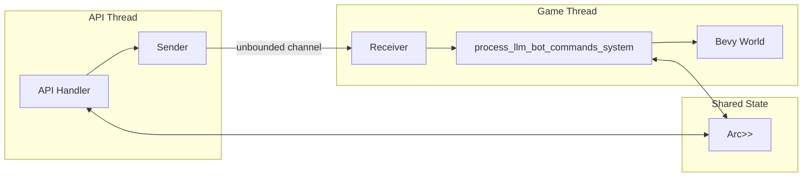

### 5.2 Command Types (`LlmBotCommand` Enum)

Defined in [`rose-offline-server/src/game/api/channels.rs`](rose-offline-server/src/game/api/channels.rs:95):

```rust
pub enum LlmBotCommand {
    // Bot Management
    CreateBot {
        bot_id: Uuid,
        name: String,
        level: u16,
        class: String,
        gender: Option<String>,
        assigned_player: String,
    },
    DeleteBot {
        bot_id: Uuid,
        response_tx: Sender<DeleteBotResponse>,
    },
    
    // Movement
    Move {
        bot_id: Uuid,
        destination: Position,
        target_entity: Option<u32>,
        move_mode: String,
    },
    Follow {
        bot_id: Uuid,
        player_name: String,
        distance: f32,
    },
    Stop { bot_id: Uuid },
    
    // Combat
    Attack {
        bot_id: Uuid,
        target_entity_id: u32,
    },
    UseSkill {
        bot_id: Uuid,
        skill_id: u16,
        target_entity_id: Option<u32>,
        target_position: Option<Position>,
    },
    Pickup {
        bot_id: Uuid,
        item_entity_id: u32,
    },
    
    // Chat
    Chat {
        bot_id: Uuid,
        message: String,
        chat_type: String,
    },
    
    // Actions
    Sit { bot_id: Uuid },
    Stand { bot_id: Uuid },
    Emote {
        bot_id: Uuid,
        emote_id: u16,
        is_stop: bool,
    },
    
    // Queries (with response channels)
    GetBotContext {
        bot_id: Uuid,
        response_tx: Sender<GetBotContextResponse>,
    },
    GetBotSkills {
        bot_id: Uuid,
        response_tx: Sender<GetBotSkillsResponse>,
    },
    GetChatHistory {
        bot_id: Uuid,
        response_tx: Sender<GetChatHistoryResponse>,
    },
    GetBotList {
        response_tx: Sender<GetBotListResponse>,
    },
    GetBotInventory {
        bot_id: Uuid,
        response_tx: Sender<GetBotInventoryResponse>,
    },
    GetPlayerStatus {
        bot_id: Uuid,
        response_tx: Sender<GetPlayerStatusResponse>,
    },
    GetZoneInfo {
        bot_id: Uuid,
        response_tx: Sender<GetZoneInfoResponse>,
    },
    
    // Utility
    AttackNearest { bot_id: Uuid },
    PickupNearestItem { bot_id: Uuid },
    TeleportToPlayer { bot_id: Uuid },
    UseItem {
        bot_id: Uuid,
        item_slot: u16,
        target_entity_id: Option<u32>,
    },
    SetBehaviorMode {
        bot_id: Uuid,
        mode: BotBehaviorMode,
    },
}
```

### 5.3 Thread-Safe State Sharing Pattern

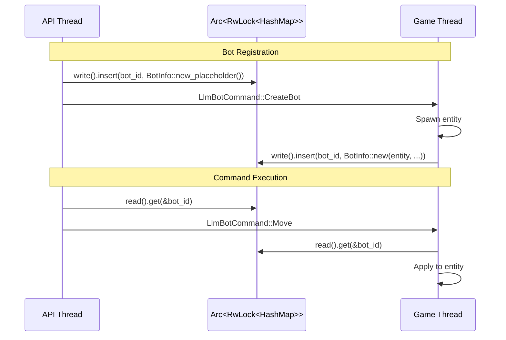

**Key Pattern - LlmBotManager:**

```rust
// channels.rs:316-434
pub struct LlmBotManager {
    command_sender: Sender<LlmBotCommand>,
    command_receiver: Receiver<LlmBotCommand>,
    bots: Arc<RwLock<HashMap<Uuid, BotInfo>>>,
}
```

---

## 6. Bot Control System

### 6.1 Bot Components

#### LlmBuddyBot Component

Defined in [`rose-offline-server/src/game/components/llm_buddy_bot.rs`](rose-offline-server/src/game/components/llm_buddy_bot.rs:76):

```rust
#[derive(Debug, Clone, Component)]
pub struct LlmBuddyBot {
    pub id: Uuid,
    pub assigned_player_id: u32,
    pub assigned_player_name: String,
    pub follow_distance: f32,
    pub chat_messages: Vec<ChatMessage>,
    pub is_following: bool,
    pub behavior_mode: BotBehaviorMode,
}
```

#### BotBehaviorMode Enum

```rust
pub enum BotBehaviorMode {
    Passive,     // Only follows, doesn't attack
    Defensive,   // Only attacks what attacks the player
    Aggressive,  // Attacks any monster in range
    Support,     // Prioritizes healing and buffing
}
```

### 6.2 Command Processing Flow

The main command processing system is in [`rose-offline-server/src/game/systems/llm_buddy_bot_system.rs`](rose-offline-server/src/game/systems/llm_buddy_bot_system.rs:100):

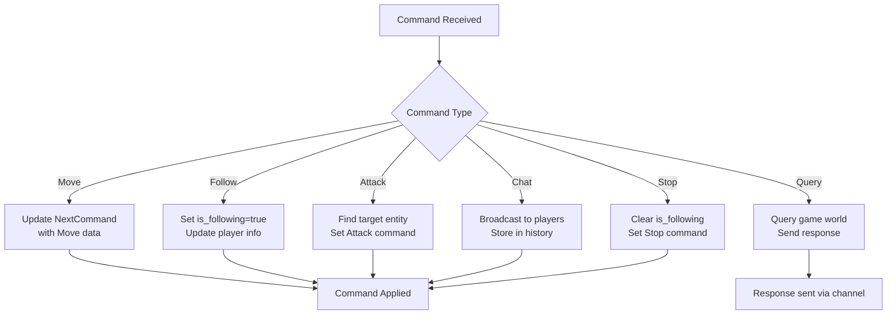

### 6.3 BigBrain AI Integration

The bot system uses the BigBrain crate for autonomous behavior. The AI system is in [`rose-offline-server/src/game/bots/mod.rs`](rose-offline-server/src/game/bots/mod.rs:125):

```rust
pub fn bot_thinker() -> ThinkerBuilder {
    Thinker::build()
        .picker(Highest)
        .when(IsDead { score: 1.0 }, ReviveCurrentZone)
        .when(IsTeleporting { score: 1.0 }, JoinZone)
        .when(HasPartyInvite { score: 1.0 }, AcceptPartyInvite)
        .when(ThreatIsNotTarget { score: 0.9 }, AttackThreat)
        .when(ShouldUseAttackSkill { score: 0.85 }, UseAttackSkill)
        .when(ShouldAttackTarget { min_score: 0.6, max_score: 0.8 }, ActionAttackTarget)
        .when(CanPartyInviteNearbyBot { score: 0.55 }, PartyInviteNearbyBot)
        .when(FindNearbyItemDrop { score: 0.5 }, PickupNearestItemDrop)
        .when(ShouldSitRecoverHp { score: 0.4 }, SitRecoverHp)
        .when(ShouldUseBuffSkill { score: 0.3 }, UseBuffSkill)
        .when(FindNearbyTarget { score: 0.2 }, AttackRandomNearbyTarget)
        .otherwise(FindMonsterSpawns)
}
```

### 6.4 Action Scoring and Prioritization

| Priority | Score | Action | Condition |
|----------|-------|--------|-----------|
| 1 | 1.0 | ReviveCurrentZone | Bot is dead |
| 2 | 1.0 | JoinZone | Bot is teleporting |
| 3 | 1.0 | AcceptPartyInvite | Has pending party invite |
| 4 | 0.9 | AttackThreat | Threat is not current target |
| 5 | 0.85 | UseAttackSkill | Should use attack skill |
| 6 | 0.6-0.8 | ActionAttackTarget | Should attack target |
| 7 | 0.55 | PartyInviteNearbyBot | Can invite nearby bot |
| 8 | 0.5 | PickupNearestItemDrop | Item nearby |
| 9 | 0.4 | SitRecoverHp | Low HP |
| 10 | 0.3 | UseBuffSkill | Should use buff |
| 11 | 0.2 | AttackRandomNearbyTarget | Target nearby |
| Default | - | FindMonsterSpawns | Otherwise |

### 6.5 Bot Behavior Modes

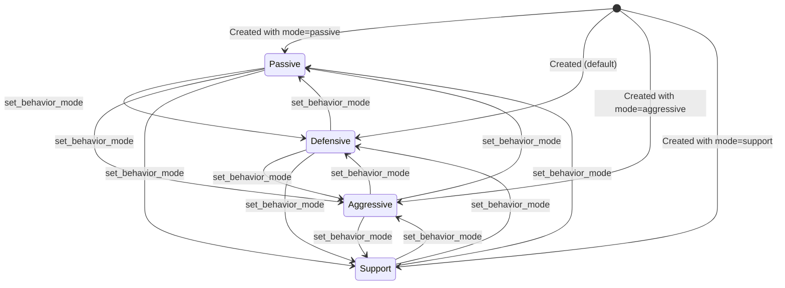

### 6.6 Available Actions

The bot AI system includes 12 action types:

| Action | File | Purpose |
|--------|------|---------|
| `ReviveCurrentZone` | [`bot_revive.rs`](rose-offline-server/src/game/bots/bot_revive.rs:22) | Revive when dead |
| `JoinZone` | [`bot_join_zone.rs`](rose-offline-server/src/game/bots/bot_join_zone.rs:18) | Join zone after teleport |
| `AcceptPartyInvite` | [`bot_accept_party_invite.rs`](rose-offline-server/src/game/bots/bot_accept_party_invite.rs:14) | Accept party invites |
| `AttackThreat` | [`bot_attack_threat.rs`](rose-offline-server/src/game/bots/bot_attack_threat.rs:21) | Attack threats |
| `UseAttackSkill` | [`bot_use_attack_skill.rs`](rose-offline-server/src/game/bots/bot_use_attack_skill.rs:27) | Use attack skills |
| `ActionAttackTarget` | [`bot_attack_target.rs`](rose-offline-server/src/game/bots/bot_attack_target.rs:20) | Attack current target |
| `PartyInviteNearbyBot` | [`bot_send_party_invite.rs`](rose-offline-server/src/game/bots/bot_send_party_invite.rs:20) | Invite nearby bots |
| `PickupNearestItemDrop` | [`bot_pickup_item.rs`](rose-offline-server/src/game/bots/bot_pickup_item.rs:25) | Pickup items |
| `SitRecoverHp` | [`bot_sit_recover_hp.rs`](rose-offline-server/src/game/bots/bot_sit_recover_hp.rs:14) | Sit to recover HP |
| `UseBuffSkill` | [`bot_use_buff_skill.rs`](rose-offline-server/src/game/bots/bot_use_buff_skill.rs:26) | Use buff skills |
| `AttackRandomNearbyTarget` | [`bot_find_nearby_target.rs`](rose-offline-server/src/game/bots/bot_find_nearby_target.rs:26) | Attack nearby |
| `FindMonsterSpawns` | [`bot_find_monster_spawn.rs`](rose-offline-server/src/game/bots/bot_find_monster_spawn.rs:18) | Find monsters |

---

## 7. Chat System Integration

### 7.1 Chat Capture Mechanism

The chat capture system is in [`rose-offline-server/src/game/systems/llm_buddy_bot_system.rs`](rose-offline-server/src/game/systems/llm_buddy_bot_system.rs:1396):

```rust
pub fn llm_buddy_chat_capture_system(
    mut bot_query: Query<(&Position, &mut LlmBuddyBot), Without<Dead>>,
    mut chat_events: EventReader<ChatMessageEvent>,
    client_entity_query: Query<&ClientEntity>,
) {
    const CHAT_CAPTURE_RADIUS: f32 = 20000.0; // 200m radius

    for event in chat_events.read() {
        for (bot_pos, mut buddy_bot) in bot_query.iter_mut() {
            // Skip if in different zones
            if bot_pos.zone_id != event.zone_id {
                continue;
            }

            buddy_bot.add_chat_message(BotChatMessage {
                timestamp: Utc::now(),
                sender_name: event.sender_name.clone(),
                sender_entity_id,
                message: event.message.clone(),
                chat_type: event.chat_type,
            });
        }
    }
}
```

### 7.2 Chat Types Supported

Defined in [`rose-offline-server/src/game/components/llm_buddy_bot.rs`](rose-offline-server/src/game/components/llm_buddy_bot.rs:31):

```rust
pub enum ChatType {
    Local,    // Proximity-based chat
    Shout,    // Zone-wide shout
    Announce, // Server announcement
    Whisper,  // Private message
}
```

### 7.3 Chat History Storage

```rust
// Maximum stored messages per bot
pub const MAX_CHAT_MESSAGES: usize = 50;

// ChatMessage structure
pub struct ChatMessage {
    pub timestamp: DateTime<Utc>,
    pub sender_name: String,
    pub sender_entity_id: u32,
    pub message: String,
    pub chat_type: ChatType,
}
```

**Storage Behavior:**
- Messages are stored in a `Vec<ChatMessage>` on each bot
- When capacity is reached, oldest messages are removed (FIFO)
- History persists for the bot's lifetime

### 7.4 How LLM Uses Chat for Context

The chat history is exposed through the `get_bot_context` and `get_chat_history` tools:

```rust
// Chat history in bot context (handlers.rs:1023-1032)
let messages: Vec<ChatMessage> = buddy_bot
    .chat_messages
    .iter()
    .map(|msg| ChatMessage {
        timestamp: msg.timestamp.to_rfc3339(),
        sender_name: msg.sender_name.clone(),
        sender_entity_id: msg.sender_entity_id,
        message: msg.message.clone(),
        chat_type: format!("{:?}", msg.chat_type).to_lowercase(),
    })
    .collect();
```

---

## 8. Bot Persistence

### 8.1 Storage Structure

Bots are persisted using the [`LlmBuddyBotStorage`](rose-offline-server/src/game/storage/llm_buddy_bot.rs) module:

**Storage Location:** `llm_buddy_bots/{bot_name}.json`

**File Format:**
```json
{
  "id": "uuid-string",
  "name": "BotName",
  "level": 50,
  "class": "knight",
  "assigned_player": "PlayerName",
  "position": { "x": 0.0, "y": 0.0, "z": 0.0 },
  "zone_id": 1
}
```

### 8.2 Save/Load Operations

**Save Operation:**
```rust
// Called when bot is created or updated
LlmBuddyBotStorage::save(&bot_name, &bot_data)
```

**Load Operation:**
```rust
// Called on server startup to restore bots
let saved_bots = LlmBuddyBotStorage::load_all();
for bot_data in saved_bots {
    // Recreate bot entity
}
```

### 8.3 Restore on Startup

Bots are automatically restored when the game server starts:

1. Server scans `llm_buddy_bots/` directory
2. Each JSON file is parsed into bot data
3. Bot entities are spawned with saved attributes
4. Bots are registered in `LlmBotManager`

---

## 9. Build and Configuration

### 9.1 Feature Flags

The `llm-feedback` feature enables the LLM Feedback System:

```toml
# Cargo.toml
[features]
default = []
llm-feedback = []
```

### 9.2 CLI Arguments

The game server accepts these CLI arguments:

| Argument | Description | Default |
|----------|-------------|---------|
| `--enable-api` | Enable REST API server | `false` |
| `--api-port <PORT>` | API server port | `8080` |
| `--api-host <HOST>` | API server host | `127.0.0.1` |

### 9.3 Environment Variables

| Variable | Description | Default |
|----------|-------------|---------|
| `ROSE_API_URL` | MCP server API URL | `http://localhost:8080/api/v1` |

### 9.4 Building and Running

**Build with LLM Feedback:**
```bash
cargo build --features llm-feedback
```

**Run Game Server with API:**
```bash
cargo run --features llm-feedback -- --enable-api --api-port 8080
```

**Run MCP Server:**
```bash
cargo run -p rose-mcp-server
```

**Run MCP Server with Custom API URL:**
```bash
cargo run -p rose-mcp-server -- --api-url http://localhost:9000/api/v1
```

---

## 10. Data Flow Diagrams

### 10.1 Command Execution Flow

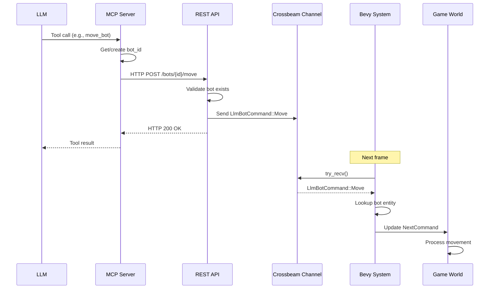

### 10.2 Bot Creation Flow

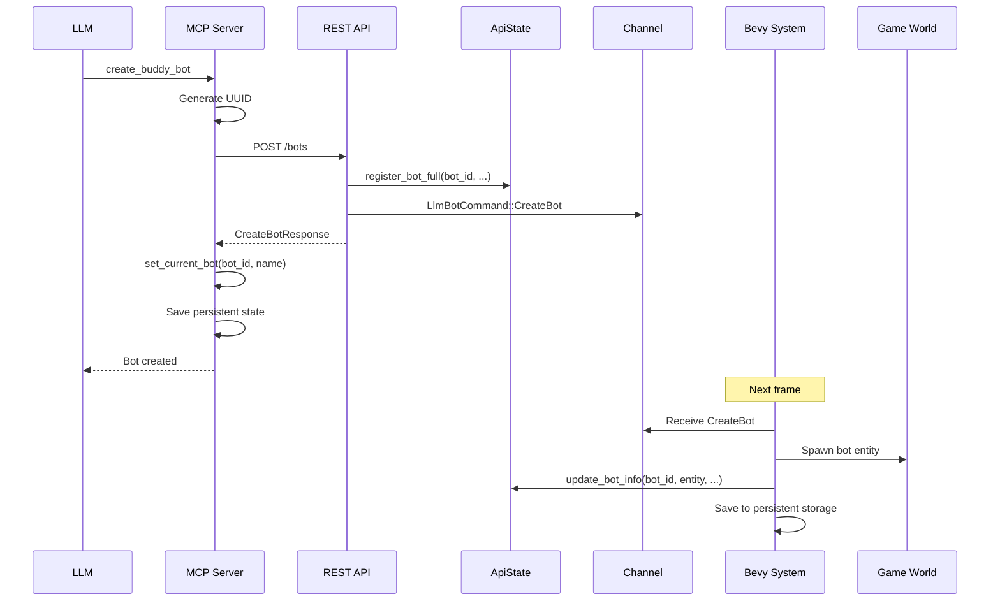

### 10.3 Chat Message Flow

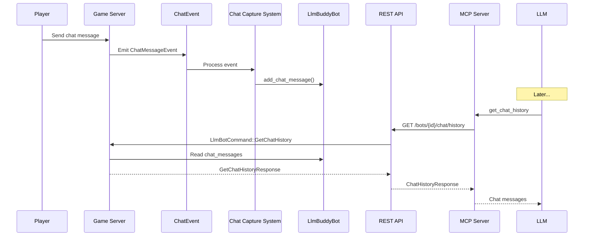

### 10.4 Status Query Flow

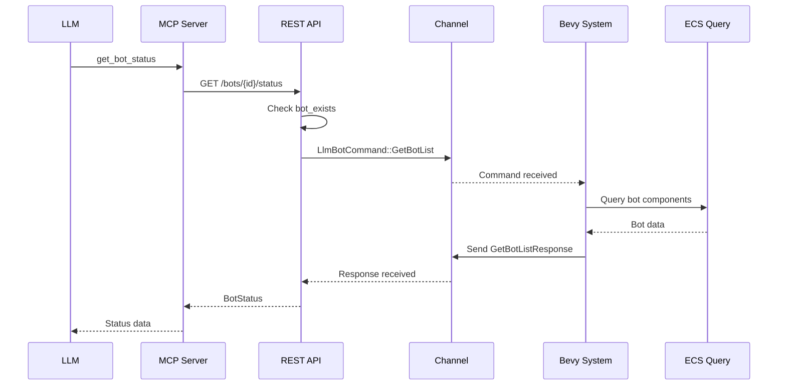

---

## 11. API Reference

### 11.1 Complete MCP Tools Reference Table

| Tool | Category | Parameters | Returns |
|------|----------|------------|---------|
| `create_buddy_bot` | Bot Management | `name`, `assigned_player`, `level?`, `build?` | `bot_id`, `entity_id`, `name`, `status` |
| `get_bot_status` | Bot Management | `bot_id?` | `bot_id`, `name`, `level`, `job`, `health`, `mana`, `position`, `current_command` |
| `list_bots` | Bot Management | - | `bots[]`, `count` |
| `remove_bot` | Bot Management | `bot_id?` | `success`, `message` |
| `get_bot_context` | Bot Management | `bot_id?` | `bot`, `assigned_player`, `nearby_threats`, `nearby_items`, `recent_chat` |
| `move_bot` | Movement | `bot_id?`, `x`, `y`, `z`, `move_mode?` | `success`, `message` |
| `follow_player` | Movement | `bot_id?`, `player_name`, `distance?` | `success`, `message` |
| `stop_bot` | Movement | `bot_id?` | `success`, `message` |
| `teleport_to_player` | Movement | `bot_id?` | `success`, `message` |
| `attack_target` | Combat | `bot_id?`, `target_entity_id` | `success`, `message` |
| `use_skill` | Combat | `bot_id?`, `skill_id`, `target_type`, `target_entity_id?` | `success`, `message` |
| `pickup_item` | Combat | `bot_id?`, `item_entity_id` | `success`, `message` |
| `use_item_on_player` | Combat | `bot_id?` | `success`, `message` |
| `send_chat` | Chat | `bot_id?`, `message`, `chat_type?` | `success`, `message` |
| `get_chat_history` | Chat | `bot_id?` | `messages[]`, `count` |
| `get_nearby_entities` | Information | `bot_id?`, `radius?`, `entity_types?` | `players[]`, `monsters[]`, `npcs[]`, `items[]`, `counts` |
| `get_bot_skills` | Information | `bot_id?` | `skills[]`, `count` |
| `get_bot_inventory` | Information | `bot_id?` | `items[]` |
| `get_player_status` | Information | `bot_id?` | `status` |
| `get_nearby_items` | Information | `bot_id?` | `items[]` |
| `get_zone_info` | Information | `bot_id?` | `zone_name`, `zone_id`, `recommended_level_min`, `recommended_level_max` |
| `set_bot_behavior_mode` | Bot Management | `bot_id?`, `mode` | `success`, `message` |

### 11.2 REST API Endpoints Reference Table

| Method | Endpoint | Description |
|--------|----------|-------------|
| GET | `/health` | Health check |
| POST | `/bots` | Create bot |
| GET | `/bots` | List all bots |
| DELETE | `/bots/{bot_id}` | Delete bot |
| GET | `/bots/{bot_id}/status` | Get bot status |
| GET | `/bots/{bot_id}/context` | Get LLM context |
| POST | `/bots/{bot_id}/move` | Move bot |
| POST | `/bots/{bot_id}/follow` | Follow player |
| POST | `/bots/{bot_id}/stop` | Stop bot |
| POST | `/bots/{bot_id}/attack` | Attack target |
| POST | `/bots/{bot_id}/skill` | Use skill |
| POST | `/bots/{bot_id}/sit` | Sit down |
| POST | `/bots/{bot_id}/stand` | Stand up |
| POST | `/bots/{bot_id}/pickup` | Pickup item |
| POST | `/bots/{bot_id}/emote` | Perform emote |
| POST | `/bots/{bot_id}/chat` | Send chat |
| GET | `/bots/{bot_id}/chat/history` | Get chat history |
| GET | `/bots/{bot_id}/nearby` | Get nearby entities |
| GET | `/bots/{bot_id}/skills` | Get bot skills |
| GET | `/bots/{bot_id}/inventory` | Get inventory |
| GET | `/bots/{bot_id}/player_status` | Get player status |
| POST | `/bots/{bot_id}/teleport_to_player` | Teleport to player |
| GET | `/bots/{bot_id}/zone` | Get zone info |
| POST | `/bots/{bot_id}/execute` | Execute LLM command |

### 11.3 Data Schemas Reference

#### Position
```typescript
interface Position {
  x: number;
  y: number;
  z: number;
}
```

#### ZonePosition
```typescript
interface ZonePosition {
  x: number;
  y: number;
  z: number;
  zone_id: number;
}
```

#### VitalPoints
```typescript
interface VitalPoints {
  current: number;
  max: number;
}
```

#### BotStatus
```typescript
interface BotStatus {
  bot_id: string;
  name: string;
  level: number;
  job: string;
  health: VitalPoints;
  mana: VitalPoints;
  stamina: VitalPoints;
  position: ZonePosition;
  current_command: string;
  assigned_player: string | null;
  is_dead: boolean;
  is_sitting: boolean;
}
```

#### BotContext
```typescript
interface BotContext {
  bot: {
    name: string;
    level: number;
    job: string;
    health_percent: number;
    mana_percent: number;
    position: Position;
    zone: string;
  };
  assigned_player: {
    name: string;
    distance: number;
    health_percent: number;
    is_in_combat: boolean;
  } | null;
  nearby_threats: ThreatInfo[];
  nearby_items: ItemInfo[];
  recent_chat: RecentChatInfo[];
  available_actions: string[];
}
```

#### NearbyEntity
```typescript
interface NearbyEntity {
  entity_id: number;
  entity_type: "player" | "monster" | "npc" | "item";
  name: string;
  level: number | null;
  position: Position;
  distance: number;
  health_percent: number | null;
}
```

#### ChatMessage
```typescript
interface ChatMessage {
  timestamp: string;
  sender_name: string;
  sender_entity_id: number;
  message: string;
  chat_type: string;
}
```

#### SkillInfo
```typescript
interface SkillInfo {
  slot: number;
  skill_id: number;
  name: string;
  level: number;
  mp_cost: number;
  cooldown: number;
}
```

#### LlmExecuteRequest
```typescript
interface LlmExecuteRequest {
  action: "follow_player" | "move_to" | "attack_nearest" | "attack_target" 
        | "use_skill" | "use_item" | "set_behavior_mode" | "say" 
        | "pickup_items" | "sit" | "stand" | "wait";
  parameters: {
    player_name?: string;
    position?: Position;
    target_entity_id?: number;
    skill_id?: number;
    message?: string;
    item_slot?: number;
    behavior_mode?: string;
    duration?: number;
  };
}
```

---

## Appendix A: File Reference

### MCP Server Files

| File | Purpose |
|------|---------|
| [`rose-mcp-server/src/main.rs`](rose-mcp-server/src/main.rs:1) | Entry point, JSON-RPC handling, tool implementations |
| [`rose-mcp-server/src/lib.rs`](rose-mcp-server/src/lib.rs:1) | Crate documentation and exports |
| [`rose-mcp-server/src/api_client.rs`](rose-mcp-server/src/api_client.rs:1) | HTTP client for REST API |
| [`rose-mcp-server/src/config.rs`](rose-mcp-server/src/config.rs:1) | Configuration types |
| [`rose-mcp-server/src/schemas.rs`](rose-mcp-server/src/schemas.rs:1) | JSON schema definitions |
| [`rose-mcp-server/src/tools/mod.rs`](rose-mcp-server/src/tools/mod.rs:1) | Tool trait and creation |
| [`rose-mcp-server/src/tools/bot_management.rs`](rose-mcp-server/src/tools/bot_management.rs:1) | Bot management tools |
| [`rose-mcp-server/src/tools/movement.rs`](rose-mcp-server/src/tools/movement.rs:1) | Movement tools |
| [`rose-mcp-server/src/tools/combat.rs`](rose-mcp-server/src/tools/combat.rs:1) | Combat tools |
| [`rose-mcp-server/src/tools/chat.rs`](rose-mcp-server/src/tools/chat.rs:1) | Chat tools |
| [`rose-mcp-server/src/tools/information.rs`](rose-mcp-server/src/tools/information.rs:1) | Information tools |

### Game Server API Files

| File | Purpose |
|------|---------|
| [`rose-offline-server/src/game/api/mod.rs`](rose-offline-server/src/game/api/mod.rs:1) | API module exports |
| [`rose-offline-server/src/game/api/server.rs`](rose-offline-server/src/game/api/server.rs:1) | Axum server setup |
| [`rose-offline-server/src/game/api/routes.rs`](rose-offline-server/src/game/api/routes.rs:1) | Route definitions |
| [`rose-offline-server/src/game/api/handlers.rs`](rose-offline-server/src/game/api/handlers.rs:1) | HTTP handlers |
| [`rose-offline-server/src/game/api/models.rs`](rose-offline-server/src/game/api/models.rs:1) | Request/response types |
| [`rose-offline-server/src/game/api/state.rs`](rose-offline-server/src/game/api/state.rs:1) | Shared state |
| [`rose-offline-server/src/game/api/channels.rs`](rose-offline-server/src/game/api/channels.rs:1) | Command channels |

### Game System Files

| File | Purpose |
|------|---------|
| [`rose-offline-server/src/game/systems/llm_buddy_bot_system.rs`](rose-offline-server/src/game/systems/llm_buddy_bot_system.rs:1) | Command processing, follow system, chat capture |
| [`rose-offline-server/src/game/components/llm_buddy_bot.rs`](rose-offline-server/src/game/components/llm_buddy_bot.rs:1) | LlmBuddyBot component |
| [`rose-offline-server/src/game/bots/mod.rs`](rose-offline-server/src/game/bots/mod.rs:1) | BigBrain bot AI system |

---

## Appendix B: Dependencies

### MCP Server Dependencies

| Crate | Version | Purpose |
|-------|---------|---------|
| `rmcp` | 0.17 | Model Context Protocol implementation |
| `tokio` | 1.0 | Async runtime |
| `reqwest` | 0.12 | HTTP client |
| `serde` | 1.0 | Serialization |
| `serde_json` | 1.0 | JSON handling |
| `anyhow` | 1.0 | Error handling |
| `uuid` | 1.0 | UUID generation |
| `clap` | 4.0 | CLI arguments |

### Game Server Dependencies

| Crate | Version | Purpose |
|-------|---------|---------|
| `axum` | 0.8 | HTTP server |
| `crossbeam-channel` | - | Thread-safe channels |
| `parking_lot` | - | RwLock for shared state |
| `bevy` | 0.15 | ECS framework |
| `big_brain` | 0.21 | AI behavior system |

---

*Document generated for ROSE Offline LLM Feedback System*
*Last updated: 2026*
