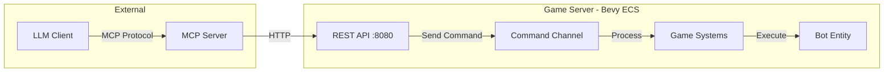
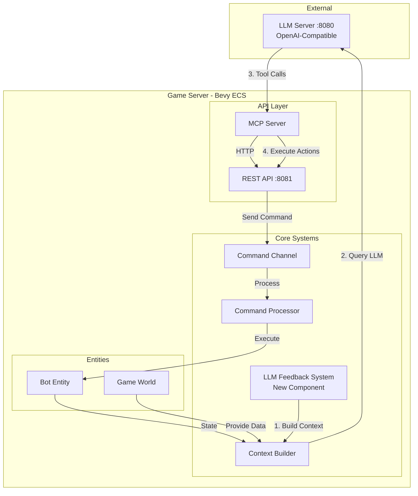
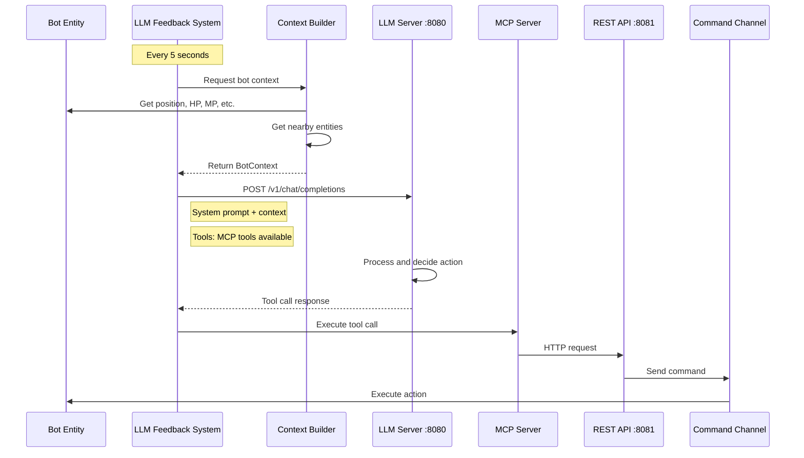

# LLM-Bot Automatic Feedback Loop Plan

## Executive Summary

This plan outlines the implementation of an automatic feedback loop between the game bots and an LLM server. The game will periodically query the LLM for decisions, and the LLM will respond with actions executed via the existing MCP/REST API infrastructure.

## Current Architecture



## Proposed Architecture



## Data Flow Sequence



## Implementation Plan

### Phase 1: LLM Client Module

Create a new module for communicating with the LLM server.

#### File: `rose-offline-server/src/game/llm_client/mod.rs`

```rust
//! LLM Client for bot decision-making
//!
//! This module provides an HTTP client for communicating with the
//! OpenAI-compatible LLM server to get bot action decisions.

mod types;
mod client;
mod tools;

pub use client::LlmClient;
pub use types::*;
pub use tools::get_mcp_tools;
```

#### File: `rose-offline-server/src/game/llm_client/types.rs`

Key types needed:
- `LlmConfig` - Configuration for LLM connection
- `ChatMessage` - OpenAI-compatible message format
- `ToolDefinition` - OpenAI-compatible tool definition
- `ToolCall` - Tool call from LLM response
- `LlmResponse` - Response from LLM

#### File: `rose-offline-server/src/game/llm_client/client.rs`

```rust
pub struct LlmClient {
    base_url: String,
    http_client: reqwest::Client,
    model: String,
}

impl LlmClient {
    pub async fn get_decision(
        &self,
        system_prompt: &str,
        context: &BotContext,
        tools: &[ToolDefinition],
    ) -> Result<Option<ToolCall>, LlmError>;
}
```

### Phase 2: System Prompt Design

Create effective system prompts for bot behavior.

#### File: `rose-offline-server/src/game/llm_client/prompts.rs`

```rust
pub fn get_buddy_bot_system_prompt() -> String {
    r#"You are an AI companion bot in a ROSE Online game world. Your role is to assist your assigned player.

## Your Capabilities
You can perform these actions by calling tools:
- follow_player: Follow your assigned player
- move_bot: Move to a specific position
- attack_target: Attack a specific enemy
- use_skill: Use a skill on a target
- send_chat: Send a chat message
- stop_bot: Stop current action
- get_bot_skills: Check your available skills
- get_nearby_entities: Scan for nearby entities

## Decision Guidelines
1. **Protect your player** - Attack threats targeting your player
2. **Stay close** - Maintain reasonable distance from your player
3. **Communicate** - Chat when appropriate
4. **Conserve resources** - Don't waste MP on weak enemies
5. **Be helpful** - Pick up items, assist in combat

## Response Format
Analyze the current situation and call ONE tool that represents the best action.
Consider: health levels, nearby threats, player status, and available skills.
"#.to_string()
}
```

### Phase 3: Context Builder Enhancement

Enhance the existing context building to provide rich LLM context.

#### Modify: `rose-offline-server/src/game/systems/llm_buddy_bot_system.rs`

Add new system for building comprehensive context:

```rust
/// Build comprehensive context for LLM decision-making
pub fn build_llm_context_system(
    bot_query: Query<(
        &LlmBuddyBot,
        &Position,
        &HealthPoints,
        &ManaPoints,
        &Stamina,
        &AbilityValues,
        &Command,
        Option<&CharacterInfo>,
        Option<&Level>,
    ), Without<Dead>>,
    player_query: Query<(&Position, &HealthPoints, &ClientEntity), Without<LlmBuddyBot>>,
    monster_query: Query<(&Position, &crate::game::components::Npc, &ClientEntity), Without<LlmBuddyBot>>,
    item_query: Query<(&Position, &crate::game::components::ItemDrop, &ClientEntity)>,
    bot_manager: Res<LlmBotManagerResource>,
    mut context_resource: ResMut<LlmContextResource>,
) {
    // Build context for each active bot
    // Store in LlmContextResource for use by feedback system
}
```

### Phase 4: LLM Feedback System

Create the main feedback loop system.

#### File: `rose-offline-server/src/game/systems/llm_feedback_system.rs`

```rust
//! System for periodic LLM decision-making

use bevy::prelude::*;
use std::time::{Duration, Instant};

/// Resource for tracking LLM feedback timing
#[derive(Resource)]
pub struct LlmFeedbackConfig {
    /// How often to query the LLM (default: 5 seconds)
    pub interval: Duration,
    /// Last time each bot was queried
    pub last_query_times: HashMap<Uuid, Instant>,
    /// Whether the system is enabled
    pub enabled: bool,
}

impl Default for LlmFeedbackConfig {
    fn default() -> Self {
        Self {
            interval: Duration::from_secs(5),
            last_query_times: HashMap::new(),
            enabled: true,
        }
    }
}

/// Resource holding the LLM client
#[derive(Resource)]
pub struct LlmClientResource {
    pub client: Arc<LlmClient>,
    pub system_prompt: String,
    pub tools: Vec<ToolDefinition>,
}

/// System that periodically queries the LLM for bot decisions
/// 
/// This system runs on a timer and:
/// 1. Checks which bots need LLM decisions
/// 2. Builds context for each bot
/// 3. Sends context to LLM server
/// 4. Processes tool calls from LLM response
/// 5. Executes actions via command channel
pub fn llm_feedback_system(
    time: Res<Time>,
    mut config: ResMut<LlmFeedbackConfig>,
    llm_client: Res<LlmClientResource>,
    context_resource: Res<LlmContextResource>,
    command_sender: Res<LlmBotCommandSender>,
    bot_manager: Res<LlmBotManagerResource>,
) {
    if !config.enabled {
        return;
    }
    
    let now = Instant::now();
    
    for (bot_id, bot_info) in bot_manager.bots_map.read().iter() {
        // Check if it's time to query this bot
        let last_query = config.last_query_times.get(bot_id)
            .copied()
            .unwrap_or(Instant::now() - config.interval);
        
        if now.duration_since(last_query) < config.interval {
            continue;
        }
        
        // Get context for this bot
        if let Some(context) = context_resource.get_context(bot_id) {
            // Spawn async task to query LLM
            let client = llm_client.client.clone();
            let prompt = llm_client.system_prompt.clone();
            let tools = llm_client.tools.clone();
            let sender = command_sender.sender.clone();
            let bot_id = *bot_id;
            
            // Use async or thread pool to avoid blocking game loop
            std::thread::spawn(move || {
                let rt = tokio::runtime::Handle::current();
                rt.block_on(async {
                    if let Some(tool_call) = client.get_decision(&prompt, context, &tools).await {
                        // Convert tool call to command and send
                        if let Some(command) = tool_call_to_command(bot_id, tool_call) {
                            let _ = sender.send(command);
                        }
                    }
                });
            });
        }
        
        config.last_query_times.insert(*bot_id, now);
    }
}
```

### Phase 5: Tool Call to Command Conversion

Convert LLM tool calls to game commands.

#### File: `rose-offline-server/src/game/llm_client/tools.rs`

```rust
//! Convert LLM tool calls to game commands

use crate::game::api::LlmBotCommand;

/// Convert an LLM tool call to a game command
pub fn tool_call_to_command(bot_id: Uuid, tool_call: ToolCall) -> Option<LlmBotCommand> {
    match tool_call.name.as_str() {
        "follow_player" => {
            let args: FollowArgs = serde_json::from_value(tool_call.arguments)?;
            Some(LlmBotCommand::Follow {
                bot_id,
                player_name: args.player_name,
                distance: args.distance.unwrap_or(300.0),
            })
        }
        "move_bot" => {
            let args: MoveArgs = serde_json::from_value(tool_call.arguments)?;
            Some(LlmBotCommand::Move {
                bot_id,
                destination: args.destination,
                target_entity: None,
                move_mode: "run".to_string(),
            })
        }
        "attack_target" => {
            let args: AttackArgs = serde_json::from_value(tool_call.arguments)?;
            Some(LlmBotCommand::Attack {
                bot_id,
                target_entity_id: args.target_entity_id,
            })
        }
        "use_skill" => {
            let args: SkillArgs = serde_json::from_value(tool_call.arguments)?;
            Some(LlmBotCommand::UseSkill {
                bot_id,
                skill_id: args.skill_id,
                target_entity_id: args.target_entity_id,
                target_position: None,
            })
        }
        "send_chat" => {
            let args: ChatArgs = serde_json::from_value(tool_call.arguments)?;
            Some(LlmBotCommand::Chat {
                bot_id,
                message: args.message,
                chat_type: args.chat_type.unwrap_or("local".to_string()),
            })
        }
        "stop_bot" => {
            Some(LlmBotCommand::Stop { bot_id })
        }
        _ => None,
    }
}

/// Get tool definitions for LLM function calling
pub fn get_mcp_tools() -> Vec<ToolDefinition> {
    vec![
        ToolDefinition {
            name: "follow_player".to_string(),
            description: "Make the bot follow a specific player".to_string(),
            parameters: json!({
                "type": "object",
                "properties": {
                    "player_name": { "type": "string" },
                    "distance": { "type": "number" }
                },
                "required": ["player_name"]
            }),
        },
        ToolDefinition {
            name: "move_bot".to_string(),
            description: "Move the bot to a specific position".to_string(),
            parameters: json!({
                "type": "object",
                "properties": {
                    "x": { "type": "number" },
                    "y": { "type": "number" },
                    "z": { "type": "number" }
                },
                "required": ["x", "y", "z"]
            }),
        },
        ToolDefinition {
            name: "attack_target".to_string(),
            description: "Attack a specific target enemy".to_string(),
            parameters: json!({
                "type": "object",
                "properties": {
                    "target_entity_id": { "type": "integer" }
                },
                "required": ["target_entity_id"]
            }),
        },
        ToolDefinition {
            name: "use_skill".to_string(),
            description: "Use a skill on a target".to_string(),
            parameters: json!({
                "type": "object",
                "properties": {
                    "skill_id": { "type": "integer" },
                    "target_entity_id": { "type": "integer" }
                },
                "required": ["skill_id"]
            }),
        },
        ToolDefinition {
            name: "send_chat".to_string(),
            description: "Send a chat message".to_string(),
            parameters: json!({
                "type": "object",
                "properties": {
                    "message": { "type": "string" },
                    "chat_type": { "type": "string", "enum": ["local", "shout"] }
                },
                "required": ["message"]
            }),
        },
        ToolDefinition {
            name: "stop_bot".to_string(),
            description: "Stop the bot's current action".to_string(),
            parameters: json!({ "type": "object", "properties": {} }),
        },
    ]
}
```

### Phase 6: Configuration and Integration

Add configuration options and integrate with the game.

#### File: `rose-offline-server/src/game/llm_client/config.rs`

```rust
//! LLM Client configuration

use serde::{Deserialize, Serialize};

#[derive(Debug, Clone, Serialize, Deserialize)]
pub struct LlmConfig {
    /// URL of the LLM server (OpenAI-compatible)
    pub server_url: String,
    /// Model to use for completions
    pub model: String,
    /// How often to query the LLM (in seconds)
    pub poll_interval_secs: u64,
    /// Maximum tokens in response
    pub max_tokens: u32,
    /// Temperature for randomness (0.0-1.0)
    pub temperature: f32,
    /// Enable/disable LLM feedback
    pub enabled: bool,
}

impl Default for LlmConfig {
    fn default() -> Self {
        Self {
            server_url: "http://localhost:8080".to_string(),
            model: "local-model".to_string(),
            poll_interval_secs: 5,
            max_tokens: 500,
            temperature: 0.7,
            enabled: true,
        }
    }
}
```

#### Update: `rose-offline-server/Cargo.toml`

Add required dependencies:
```toml
[dependencies]
# ... existing dependencies ...
reqwest = { version = "0.11", features = ["json"] }
tokio = { version = "1", features = ["rt-multi-thread"] }
```

## Detailed Implementation Steps

### Step 1: Create LLM Client Module
- [ ] Create `rose-offline-server/src/game/llm_client/mod.rs`
- [ ] Create `rose-offline-server/src/game/llm_client/types.rs` with request/response types
- [ ] Create `rose-offline-server/src/game/llm_client/client.rs` with HTTP client
- [ ] Create `rose-offline-server/src/game/llm_client/tools.rs` with tool definitions
- [ ] Create `rose-offline-server/src/game/llm_client/prompts.rs` with system prompts
- [ ] Create `rose-offline-server/src/game/llm_client/config.rs` with configuration

### Step 2: Create Context Resource
- [ ] Create `LlmContextResource` to store built contexts
- [ ] Modify existing context building to populate this resource
- [ ] Add nearby entity queries (monsters, items, players)

### Step 3: Create Feedback System
- [ ] Create `rose-offline-server/src/game/systems/llm_feedback_system.rs`
- [ ] Implement `LlmFeedbackConfig` resource
- [ ] Implement `LlmClientResource` resource
- [ ] Implement `llm_feedback_system` with async support

### Step 4: Integration
- [ ] Add `llm_client` module to `lib.rs` or `mod.rs`
- [ ] Register resources in plugin
- [ ] Add system to schedule with appropriate run criteria
- [ ] Add configuration loading from file/env

### Step 5: Testing
- [ ] Unit tests for LLM client
- [ ] Unit tests for tool call conversion
- [ ] Integration test with mock LLM server
- [ ] End-to-end test with real LLM

## OpenAI-Compatible API Request Format

```json
{
  "model": "local-model",
  "messages": [
    {
      "role": "system",
      "content": "You are an AI companion bot..."
    },
    {
      "role": "user",
      "content": "Current context:\n{\n  \"bot\": {...},\n  \"nearby_threats\": [...],\n  \"assigned_player\": {...}\n}\n\nWhat should you do?"
    }
  ],
  "tools": [
    {
      "type": "function",
      "function": {
        "name": "attack_target",
        "description": "Attack a specific target enemy",
        "parameters": {
          "type": "object",
          "properties": {
            "target_entity_id": { "type": "integer" }
          },
          "required": ["target_entity_id"]
        }
      }
    }
  ],
  "tool_choice": "auto",
  "max_tokens": 500,
  "temperature": 0.7
}
```

## Error Handling

1. **LLM Server Unavailable**: Skip this decision cycle, retry next interval
2. **Invalid Tool Call**: Log error, skip action, continue operation
3. **Timeout**: 2-second timeout for LLM requests, skip on timeout
4. **Rate Limiting**: Built-in interval prevents rate issues

## Performance Considerations

1. **Non-blocking**: LLM queries run in separate thread/task
2. **Caching**: Context is built once per interval per bot
3. **Throttling**: Fixed 5-second interval prevents overload
4. **Resource cleanup**: Failed requests don't leak resources

## Security Considerations

1. **Local-only**: LLM server should be localhost only
2. **No authentication needed**: For local development
3. **Input validation**: Validate all tool call arguments
4. **Action limits**: Bot can only affect its own entity

## Future Enhancements

1. **Event-driven triggers**: Query LLM on important events (low HP, player chat)
2. **Conversation history**: Maintain chat history with LLM for context
3. **Multiple bots**: Parallel processing for multiple bots
4. **Dynamic prompts**: Adjust system prompt based on situation
5. **Learning**: Store successful decisions for future reference
